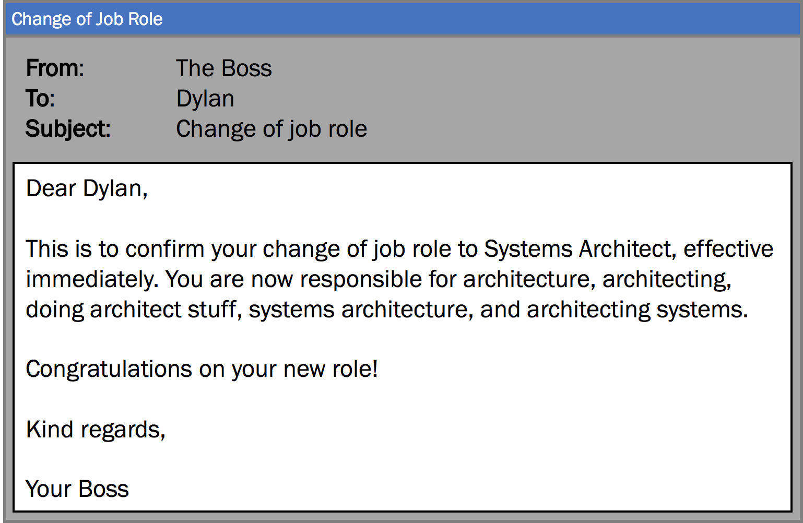
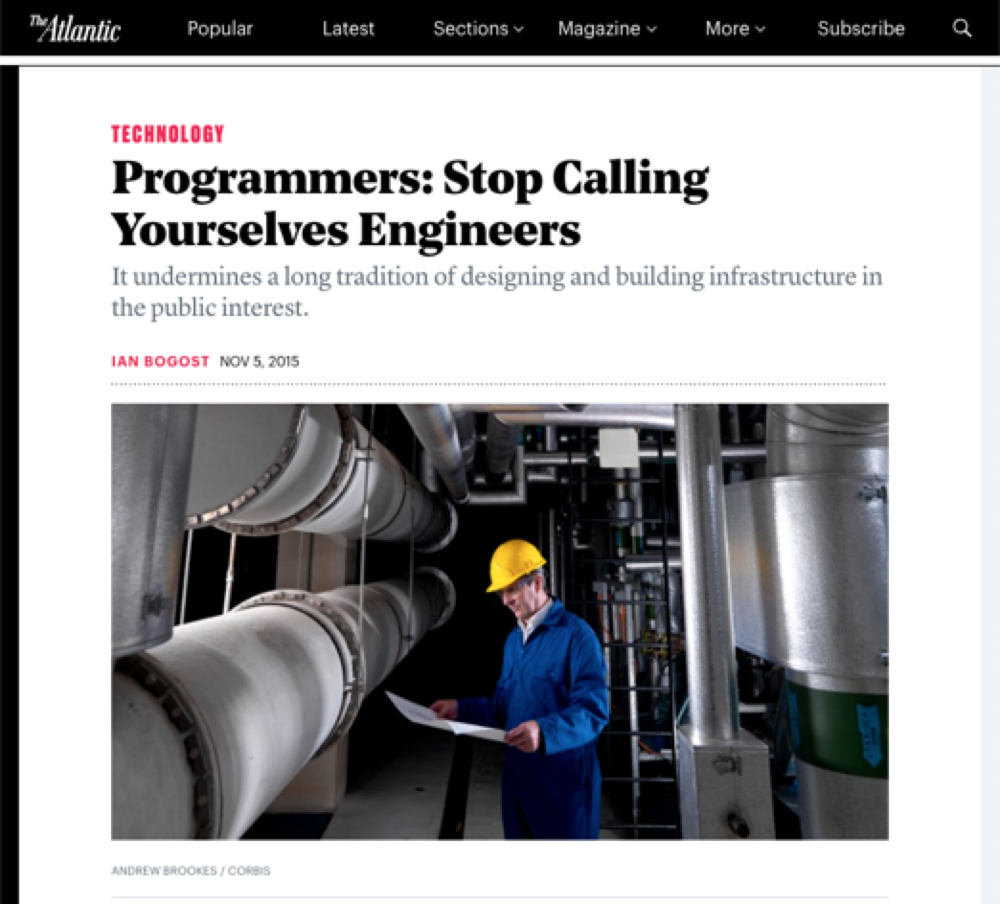
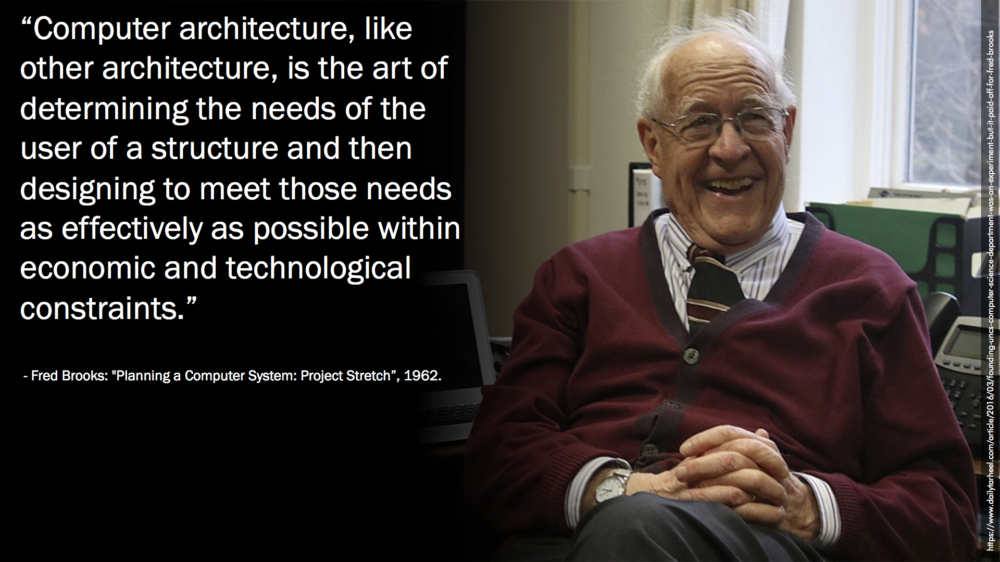
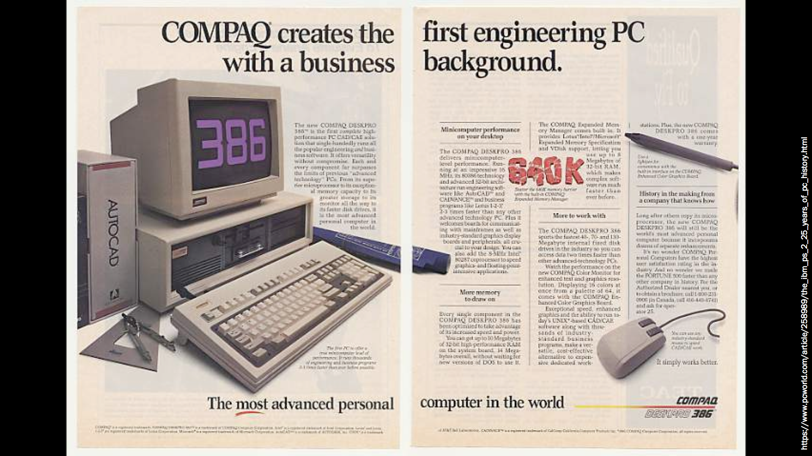
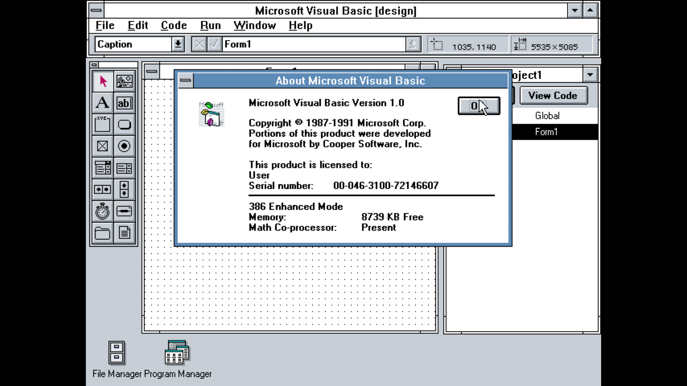
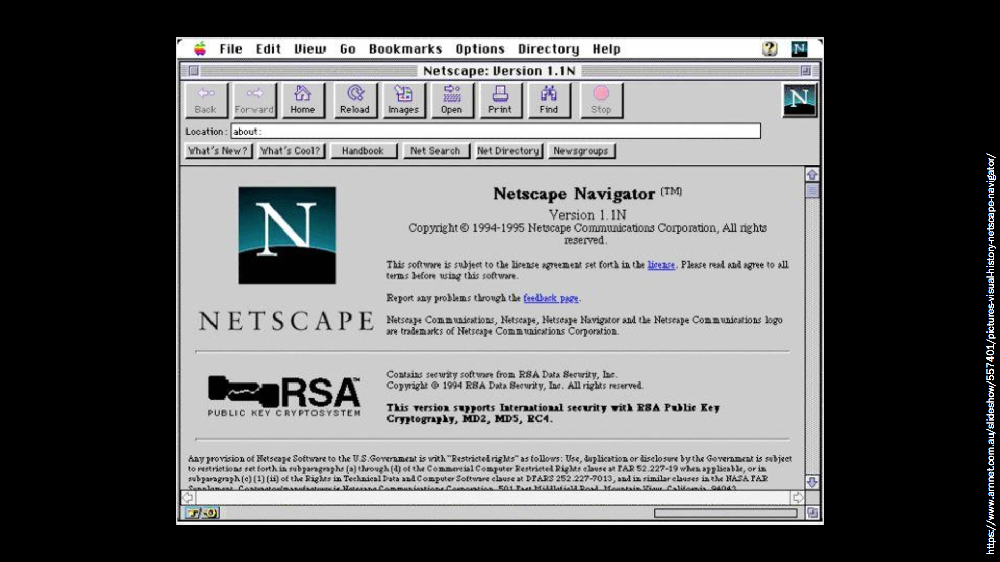
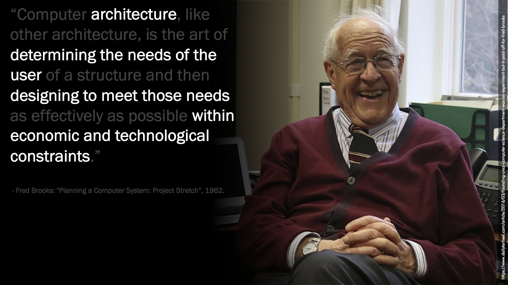
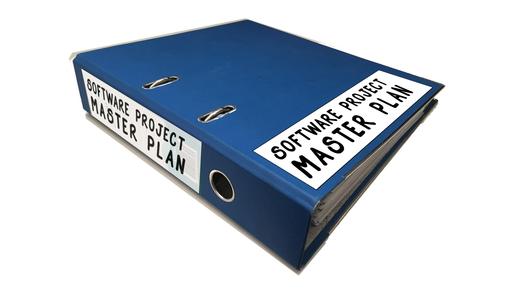

**We’ve all heard of the idea of ‘software architecture’. We’ve read books about domain-driven design and event sourcing, we’ve been to conferences and learned about micro services and REST APIs. Some of us remember working with n-tiers and stored procedures... some of us are still using them. But the role of a systems architect is still one of the most misunderstood things about the software development process. What does the architect actually do? If you’re working with a systems architect, what can you expect from them? And if you are a systems architect, what are your team expecting from you? In this talk, Dylan will share his own insights into the idea of architecture as part of a software development process. We’ll explore some popular architectural patterns and processes — and a couple of obscure ones as well — and look at how, and when, you can incorporate those patterns into your own projects. We’ll talk about how the idea of software architecture has changed over time, and share some tips and advice for developers who find themselves working with architecture as part of their role.**

Hello everyone! My name is Dylan Beattie, and I’m here today to talk to you about one of the most important, and most misunderstood, elements of modern software development. I’m here to talk to you about architecture - "the stuff that’s hard to change."

I've been programming computers for a long time - I started out writing quiz games in BASIC when I was eight years old; I taught myself HTML and CGI programming in the 1990s, I went to University and got a degree in Computer Science, I spent a couple of years building little database-driven websites in classic ASP, and then I got a job running the IT team at a company in London called Spotlight.

And sometime around 2011, we got some consultants in to help us figure some things out, and one of the things they suggested was that I be officially designed the 'systems architect'. And I got an email confirming my new role...

...and then I went back to my desk - same desk, same computer, same team, same code... and you know, being a systems architect felt an awful lot like being a programmer. Except I had to go to more meetings, and I had this nagging feeling that maybe there was something I was supposed to be doing differently, but I had no idea what that was.

So I figured that if this was my job now, I should probably try and work out what it meant, right? I started researching. I read books. I went to meetups. I went to conferences. I met other people who were working on software architecture, and, slowly, it started to make sense. I don't mean that it got easy – software architecture is hard, building complex systems is hard, and even with the best people and the best technology in the world I don't think it's going to get much easier – but I did develop a much more helpful understanding of what software architecture actually is. So let's start with that: what do we actually mean by talking about software architecture? You see, one of the biggest challenges we face when we talk about software is that we are constantly borrowing words from other fields. Sometimes that helps - like, when we talk about high-performance computing, it’s helpful to draw comparisons with high-performance cars and high-performance aircraft. But sometimes, the words we borrow end up so far removed from their original dictionary definitions as to be almost completely meaningless.

"Yeah, we were planning to launch last week, but we couldn't get Python to connect to the bus properly - would you believe it turned out be a conflict with the mouse driver?"

{: .animated-gif }

Now you wouldn't think twice if you overheard somebody say that at, say, a tech conference party - but somebody who has never dealt with virtualised hardware support when building a Python system to connect to a message bus will be thinking 'what the hell do you *do*?'. And when you answer 'oh, I'm an architect' - that's really not much help.

Let’s start with some job titles - because even here, in 2019, it’s still not really clear what a lot of these terms mean. Let’s try a show of hands. Raise your hand if you’d call yourself a coder? A programmer? A developer? A hacker? A software engineer?

<figcaption>Headline from an article in The Atlantic titled <a href="https://www.theatlantic.com/technology/archive/2015/11/programmers-should-not-call-themselves-engineers/414271/">Programmers, Stop Calling Yourselves Engineers"</a></figcaption>

There’s actually some serious discussion going on around the world right now about whether people who build computer software – you know, people like us; coders and hackers and programmers and developers – are allowed to call themselves engineers. [In Canada, you can’t call yourself any kind of engineer unless you’ve got a government license](https://en.wikipedia.org/wiki/Regulation_and_licensure_in_engineering#Canada). In New Zealand, you can be a software engineer if you’ve got a [university degree in software engineering](https://en.wikipedia.org/wiki/Regulation_and_licensure_in_engineering#Australia_and_New_Zealand) - but not if you’ve got a degree in computer science. In the UK, if your cable TV stops working, the TV company sends out an ‘engineer’ - and last time I had to do that, I’m pretty sure the person who came to my house to fix the TV didn’t have a formal engineering qualification. Or perhaps they did - but I definitely didn't see them preparing any engineering drawings before they fixed the cable. 

<figcaption>Margaret Hamilton. Photo: <a href="https://commons.wikimedia.org/wiki/File:Margaret_Hamilton_1989.jpg">Wikimedia Commons</a></figcaption>

The first person to popularise the term ’software engineering’ was this woman - Margaret Hamilton, who led the software team that created the guidance systems used in the Apollo moon landings. Hamilton was a strong advocate of something she called a systems view – she considered the software created by her team every bit as important as all of the other systems that formed part of the Apollo programme, and her use of the term ’software engineering’ was intended to emphasise a distinction between simply writing code, and the creation of software as an engineering discipline like mechanical engineering or electrical engineering. Being able to write code doesn’t make you a software engineer, any more than knowing how to lay bricks makes you a structural engineer. 

I like this definition. Software engineering isn’t just about writing code – it’s about using software to create complex systems that form part of a larger solution. Building things that are too important or too complex to just throw them away and start again if they don’t work right. Maybe that complex system is ALL software – multiple components and modules that need to work together to provide a service. Maybe that complex system has hardware components as well – a smart phone, a cash machine, the environment control system in a building. There’s another definition of engineering which might help us, too, which is that engineering is what happens when the people who design something aren’t the people who build it. 

<figcaption>Barbecue photo: <a href="https://www.gardenersworld.com/how-to/diy/how-to-build-a-brick-barbecue/">Gardeners' World</a>. Brooklyn Bridge: <a href="https://commons.wikimedia.org/wiki/File:Brooklyn_Bridge_Manhattan.jpg">Wikimedia Commons</a></figcaption>

If you’re building a barbecue in your back yard, you’re probably going to be building it yourself - sure, you might design it on paper first, and you might get some friends round to help, but when it’s time to actually build it, you’re going to be mixing cement and laying bricks. If you’re designing a new office block or a hospital or a bridge, it is very unlikely you’re going to be on any of the construction crews that actually build the thing - because that’s "proper" engineering.

And there’s all kinds of engineering. Civil engineering, aerospace engineering, mechanical engineering – and it seems pretty logical that when we started creating large, complex computer systems, where there was some sort of separation between people doing the designs and people doing the actual development, we’d start talking about software engineering, right?

<figcaption><a href="https://picryl.com/media/sydney-opera-house-ad3359">Sydney Opera House</a>, <a href="https://commons.wikimedia.org/wiki/File:Moscow,_Hotel_Ukraina_(30585861673).jpg">Hotel Ukraina in Moscow</a>, <a href="https://commons.wikimedia.org/wiki/File:Bristol_Balloon_Fiesta_-_panoramio_(1).jpg">Clifton Suspension Bridge</a>, <a href="https://franklloydwright.org/site/fallingwater/">Fallingwater</a>, <a href="
 https://commons.wikimedia.org/wiki/File:St_Pauls_Cathedral_3_(8013450111).jpg">St Pauls Cathedral</a></figcaption>

But until very recently the word ‘architecture’, in English, ALWAYS referred to buildings and construction. There’s never been any such thing as an aeroplane architect or a racing car architect - architects work on structures. Cathedrals, bridges, skyscrapers… you know. These amazing and wonderful things all around us, made out of timber and concrete and glass and steel.

The first person to use the phrase “computer architecture” was Fred Brooks. Brooks is the guy who wrote “The Mythical Man-Month”, and published a lot of very influential papers about computer engineering. In 1962, Brooks wrote:

> Computer architecture, like other architecture, is the art of determining the needs of the user of a structure and then designing to meet those needs as effectively as possible within economic and technological constraints.

This appears to be the first usage of the word “architecture” in reference to designing computer systems – and it caught on. Throughout the 1970s and 1980s, people were talking about “machine architecture” and “systems architecture”, but this was almost always referring to the hardware – the physical and logical design of the components of a computer system. We’d talk about x86 architectures and RISC architectures. Architecture meant things like the how many bits the processor could handle in a single instruction – and that’s a good early example of architecture as “stuff that’s hard to change”. You could always patch the operating system code, or add another serial port or change the video display card, but if you changed something like the bit width of the processor, you’d have to redesign pretty much the entire system, which would mean throwing away everything else – all the other components, all the firmware, software, BIOS code.

In 2010, Fred Brooks did an [interview with WIRED magazine](https://www.wired.com/2010/07/ff-fred-brooks/), and they asked him “what do you consider your greatest technological achievement?” Brooks answered that it was changing the IBM 360 series from using 6-bit bytes to using 8-bit bytes. Until the 360, almost every computer used 6-bit bytes and 36 bits to represent integers – so this was a really, really expensive change. But it was worth it. 8 bits meant you could support a full character set - well, a full American character set, but at least you could have uppercase and lowercase letters, numbers and punctuation. The IBM 360 became so successful, and so influential, that if it had shipped with 6-bit bytes and 36-bit words, it’s quite possible the entire industry would have followed that convention - but thanks to Brooks, we get 8 bits and 32-bit integers. Thank you, Fred. 🙂

<figcaption>Compaq PC advert via <a href="https://www.pcworld.com/article/258989/the_ibm_ps_2_25_years_of_pc_history.html”>PC World</a></figcaption>

It wasn’t until the 1990s that people started talking about SOFTWARE architecture – and I think that’s because, up until the 1990s, distributed systems were still relatively rare. The vast majority of computer software up until the 1990s was monolithic applications running on one single computer – one of the big selling points of Microsoft Windows 3.1 was that you could run two programs at the same time. There were teams out there building and deploying complex applications that used modular designs, but software architecture as a discipline didn’t really exist yet.

Now, personally, I believe the reason for that is all to do with that phrase I keep using – “the stuff that’s hard to change”. And I think it’s fair to say that up until the 1990s, software just wasn’t perceived as expensive to change – and there’s two reasons for that. Firstly, software is, fundamentally, pretty easy to change. You just edit the files and run the compiler, right? And remember, we’re talking about applications that had to fit on a 720Kb floppy disk and run in 640Kb of memory. There just wasn't that much code to worry about; this was the days when one person working hard for a couple of weeks could create a bestselling game or a genuinely revolutionary software application.

There were bigger and more complex applications as well, of course – mainframe systems, embedded systems, right up to things like the Apollo 11 guidance system itself – but for those kinds of systems, the software was normally part of a complete solution that included hardware, training, installation... and so the cost of developing the software still represented a relatively small part of the total cost of the system, and the cost of *changing* the software was minimal compared to the cost of changing just about anything else in that system.

<figcaption>Visual Basic 1.0. Photo from <a href="https://winworldpc.com/product/microsoft-visual-bas/10">WinWorldPC</a></figcaption>

The turning point came in the 1990s, and there are two fundamental reasons for that. First was Microsoft Windows,and Visual Basic. It sounds crazy now, but Visual Basic fundamentally changed the rules of business computing, because it made it easy to write your own programs. Microsoft Windows was a hugely successful operating system, and Visual Basic meant that your business could hire somebody, relatively cheaply, to create bespoke software. Business automation promised all sorts of cost savings and efficiencies (anyone remember people talking about the “paperless office”?) and so a lot of small businesses started hiring people to write software for them. And of course that software would need bugfixes, and updates, and so a lot of companies suddenly discovered they were actually spending quite a lot of money on... changing software.

<figcaption><a href="https://www.arnnet.com.au/slideshow/557401/pictures-visual-history-netscape-navigator/">Netscape Navigator 1.1N</a></figcaption>

The other thing that happened, of course, is the World Wide Web. The Web revolutionised a lot of things, but the fundamental thing it allowed us to do was to provide software to people as a service. Not as a disk in a box that somebody had to install on the PC in their office; we could run that software on our computers, on our servers, and yet people all over the world could use it. First it was just static websites; then it was the search engines, and web-based email – and now here we are in 2019, where you can do just about anything by pointing your browser at the right website. And the companies that operate those websites, from the 1990s right up to today, often don't have any assets at all except software. The cost of running and changing that software – developers, infrastructure, operations – can be close to 100% of the company's operating budget.

And so, within a fairly short space of time, people started thinking really, really hard about how to manage the cost, and the risk, of making changes to complex software systems – and this whole field became known as 'software architecture’. 

This book – “Software Architecture: Perspectives on an Emerging Discipline” by Mary Shaw and David Garlan – was published in 1996, and was had a huge influence over how we apply the idea of 'architecture' to the development of software systems.

But let go back and look at that definition from Fred Brooks again:

> Computer architecture, like other architecture, is the art of determining the needs of the user of a structure and then designing to meet those needs as effectively as possible within economic and technological constraints.

Now, I like this definition, so let's use this as a starting point. You're the architect, which means you do the architecture. Which means your job is effectively three things:

* determine the needs of the user

* design to meet those needs as effectively as possible

* within economic and technological constraints.

So... if you're the architect, who is the user? 

I struggled with this for a while, because - like a lot of developers - I was used to the idea of the user being, you know, users. The people who actually click the buttons and fill out the forms and complain on Twitter when something doesn't work. But when you are an architect, YOUR users are not the people out there in the real world who will be using the software. Your users are the developers. Your job, as an architect, is to work out what the developers on your teams will need to know in order to do *their* jobs. Oh, but hang on a second. It's more complex than that. Some of your users are the developers who are already here, working on features that are already planned, to deliver products to customers you've already got. 

But architecture is about managing the long-term cost of change. So your users - the people whose needs you’re trying to meet - are developers you haven’t hired yet, using languages and tools that don’t exist yet, to create products you haven’t thought of yet for customers you haven’t met yet. Easy!

By the way, I'm using the word 'team' here quite a lot, so it might help to clarify that a bit. When I say 'team', in this talk, I mean a small group of people who are talking to each other every day, who review each others' code and pull requests. I'm assuming that the architect is working with more than one team, and I'm assuming that there's some sort of separation between those teams – we'll talk more on that a bit later.

So, you're the architect, your users are development teams, and you need to design *something* that meets the needs of those users. And also anticipates the needs of the developers who will be working on your codebase in two, five, ten years time.

That sounds to me a lot like we’re going to need some sort of plan...

..and when it comes to software development, the whole concept of planning has has had a bit of a rough time over the last few decades.

You've all are familiar with the agile manifesto, right? I think agile has caused a huge amount of damage when it comes to software architecture, because a lot of people have misinterpreted the agile manifesto as ‘you don’t need to make a plan’.

Now you may not know this, but at one point in his career, the great French philosopher Jean-Paul Sartre did a little work as an agile consultant. And Sartre is working with a client one day, and he says to them “you know, the agile manifesto recommends that we should respond to change instead of following a plan.” And the client says “oh, that’s easy - we don’t have a plan!” – and Sartre exclaims “*Sacre bleu!* But if you do not have a plan, how can you choose not to follow it?”

Sartre would later go on to write [Being and Nothingness](https://en.wikipedia.org/wiki/Being_and_Nothingness), in which he discusses the illusion of choice and 

It’s the same with agile - if you don’t have a plan, you’re not actually choosing not to follow it. The thing that the authors of the agile manifesto were trying to solve was teams delivering the WRONG THING because that’s what they had planned to do - even when it was obvious that it was going to be wrong.

So you have to have a plan. And you have to be prepared to change it. But trying to do architecture without any kind of plan or up-front design is never going to work.

Whilst we're on the subject of agile, there’s another statement I want to talk about. This is one of the principles behind the agile manifesto: ‘the best architectures, requirements and designs emerge from self-organising teams’. And again, a lot of people have interpreted this to mean ‘yay! we don't need any managers; the team can just organise themselves!’.

That's not what it means. It means that if a team does being to self-organise, you should be prepared to let it happen. Self-organising means you don’t TELL the team how to work; you give them the autonomy to figure it out for themselves. But if a team comes to you and asks for help, asks for some support when it comes to organising, holy shit you’d better have something better to offer them than ‘go over there and self-organise’.

And, again, that comes down to having a plan, but being flexible enough to update it when reality happens.

And, finally, that qualifier: "within economic and technological constraints." In software, those constraints can be really, really difficult to understand - but they do exist. You come up with a beautiful design for a distributed system that requires eight development teams, you go to your CFO and find out you've only got budget to hire four people? Boom. Economic constraint. You design a really clever mobile phone application for scanning people's passports and then find out that iOS won't let your application use the near-field RFID scanning on Apple devices? Boom. Technological constraint.

Sometimes, those constraints are obvious. Sometimes you'll only find them out as you go along. Sometimes they'll change halfway through a project - you're happily building modules and services and somebody from the legal team comes over and asks if you've heard about this thing called GDPR.

Sometimes, the 'obvious' constraints are actually the things you should challenge the hardest, because things change faster than people do. The first wave of smartphones were all designed with the constraint that you can’t use a touchscreen on a mobile phone - it’d make the handsets too expensive, and even if you could do it, it wouldn’t work properly. And so when touchscreen technology got good enough that you COULD put it in a mobile phone, nobody was paying attention… except Apple. Now, that shouldn’t be an architectural DECISION - but you should absolutely be prepared to challenge the perceived constraints if you think they’re not valid.

The hard thing about those constraints is that, often, the architect ends up being the person who has to tell the dev teams why they can't do things the way they want to. You can't use that neat JavaScript library you found, because one of our biggest customers is still using Internet Explorer and we need to support them. There will be objectives and constraints that make sense at a strategic level, but for developers trying to ship working code, they're just a pain in the ass - and as the architect, it's up to you to manage that.

So, we've identified the PURPOSE of architecture:

\* determine the needs of the user

\* design to meet those needs as effectively as possible

\* within economic and technological constraints.

Now I want to talk about the PROCESS of architecture. How do you do actually do it?

Again, I like to think of this in three phases.

\1. MAKE DECISIONS

\2. COMMUNICATE DECISIONS

\3. ENFORCE DECISIONS

Now, this isn't waterfall. This doesn't mean if you're trying to launch a product by the end of the year, you spend three months making decisions, three months communicating them and three months reinforcing them. You'll be doing this a lot. Sometimes, the whole cycle will take a couple of hours; sometimes it'll take weeks. Sometimes the outcome will be one single API endpoint, sometimes it'll be a roadmap and a tech strategy for an entire product - but here's some steps that might help you work through it.

\## Making Decisions

\### Identify what you've already got.

As an architect, this is fundamental to doing your job well. You need to understand what's already in play. 

At this stage, forget about reading code and studying documentation. Sure, that might help, but it's often not the quickest way to develop the understanding that you need. What you're looking for here are components and connectors. Here's the simplest possible architecture - a static website. And even here, there's two components - there's your static website, and there's the rest of the world - and a connector. This thing. HTTP. You need to understand what it can do. How many requests per second are you handling right now? How many CAN you handle? If you had to scale up, could you? Is there any kind of security on that? What about authentication? There's that great line from the movie Apollo 13 - "I don't care about what anything was DESIGNED to do; I care about what it CAN do".

If you're looking at more complex systems, this can be a lot of work - but there will always be SOMETHING you can do to understand the nature of the traffic that's flowing across those boundaries. See if you can get hold of the HTTP logfiles from the web servers. Got a database? See if you can get a profile trace, something that shows you what sort of queries are running against it, how long they're taking. If you're lucky, tools like NewRelic or Rollbar or MiniProfiler will already be integrated.

Even if you're designing a completely new greenfield system, you STILL have existing components and constraints to think about. What sort of devices are you targetting? What sort of connectivity is available between your platform and your end users? Who are the developers you'll be working with, and what are they good at? If you don't have any developers yet, what's the recruitment and onboarding process? If you don't have one of those... well, at that point I'd be asking why they think they need a systems architect, but it matters.

Of course, most of us don't get to build greenfield systems; most organizations have systems running in production already. And as an architect, you need to understand what those systems can do - and what they can't. 

\### Asking the Right Questions

Another really valuable skill for an architect is being able to translate between business requirements and engineering requirements. Stakeholders always want the same things - fast, secure, usable. Well, when developers hear 'fast', their eyes light up, they remember that one talk they saw at a conference about how StackOverflow use Redis to improve response times, and they start working on a way to cache all your web pages in a giant Redis cluster because the business wants it to be 'fast'. Then the stakeholders ask why it's taking so long and why your latest AWS invoice has $3,500 for something called 'reee-dis' on it.

Fast. Secure. Usable. These terms aren't actually terribly useful at all. What you want are metrics. FAST. OK, how about if commit to delivering page load in under 2.5 seconds for 95% of page requests? Then go a step further - you know from your investigations that you get about 100 requests per minute, so every minute, you're gonna get ninety-five happy users, and five people who have to wait just a little bit longer. Maybe ten seconds.

If that's not acceptable, give 'em some numbers to work with. What would you need to do to get from 95% to 99% - and what would that cost, in terms of development time, in terms of infrastructure? Maybe there's another solution? How much of that page load time is the Javascript libraries for your in-page advertising?

'Secure' is another term that gets thrown around a lot but isn't actually very useful. The important questions here. Who's the threat profile? Are we worried about angry ex-boyfriends trying to break into somebody's email? Are we worried about Chinese botnets trying to bruteforce their way in using a password list they found on the darkweb? Or are we worried about MOSSAD? What about the contractors we've hired to do network support? Do we need to worry about what they have access to? Again, each of these questions is the starting point for a conversation about how we balance technological complexity with business constraints. Worried about angry ex-boyfriends? Use two-factor authentication and hope they didn't leave their phone at home. Chinese botnets? Enforce password complexity, maybe implement an artificial delay or a limit on login attempts. MOSSAD? They're probably already in, so stop worrying about it and get on with your life.

And for all these sorts of considerations, ask yourself how you'll know if it turns out you were wrong. If your page load times go from 2 seconds to 5 seconds to 10 seconds, how do you know about it? If a Chinese botnet managed to log into a hundred of your user accounts, how would you know about it?

The responses to these incidents aren't necessarily going to be technological, but the first sign that they're happening is almost always going to be something unusual happening somewhere on your network.

\### What can you build? People, patterns, packages and process.

People? Who have you got? What are they good at? What’s their thing? If you need to hire people, how easily can you do it? 

Patterns? 

Packages?

Process?

We already talked about knowing what's already running inside your organisation. But just as important is understanding what else is available out there in the world. As an architect, it's your responsibility to know what's out there - frameworks, tools, patterns, languages. Understand the capabilities, and the costs, of all those options - in the context of YOUR ORGANISATION.

You've got to be careful here. Technology is EXCITING. Frameworks are SHINY. The stuff you're already using? You know everything that's wrong with it. You know about the headaches and the bottlenecks and the configuration problems, because when it's actually RUNNING, the good stuff becomes invisible, you take it for granted, and the bad stuff keeps interrupting your day.

But the new amazing frameworks and patterns that you read about on Twitter and learn about at conferences and user groups? They're PERFECT! They'll solve ALL YOUR PROBLEMS!

Well, reality check. They won't. Nobody ever stood up at a tech conference and said 'Hey! This is our amazing new JavaScript component library! It crashes on most versions of Safari, there's at least four security vulnerabilities that we haven't found yet, and your development team will absolutely hate it because it interferes with jQuery."

Now, one of the best things about being an architect is that a big part of your job is to actually try these things out. Download those frameworks, install the tools, try them out, see what they can do - and then share your findings with the developers on your teams. But remember, taking a couple of days to experiment with something is no substitute for running it in production for a year or two.

You'll also need to develop a really keen understanding for the distinction between patterns, libraries and frameworks. Patterns will give you two things. They'll give you a blueprint for how to build something, and they'll give you a common vocabulary so you can talk about the things you're building. Your teams will still be writing the actual code, but using design patterns can take a lot of the guesswork out of the implementation process.

Libraries are the things you can drop into an existing codebase and hook into to do something useful... and when you're not using them, they're basically invisible. Encryption, image processing, rendering PDFs - those kind of things. Proven solutions to common problems, that nobody's gonna pay you to reinvent. Install the NuGet package, or the Ruby gem, or the npm package, and away you go.

Frameworks? Frameworks are definitely architecture, because if you pick the wrong one, you will definitely, definitely find that it is hard to change. Frameworks are to modern software applications what processor design was to the microcomputers of the 1970s and 1980s; when you make the decision to use a particular application framework, that decision can end up in affecting almost every part of your codebase.

But... some frameworks are actually amazing, in terms of reducing complexity and development time. So take the time to see what they can do. Talk to people who've used them in production. Do a bit of research, find out how easy it is to hire people who work with them - and how quickly that's changing.

\### LOOK FOR COMMONALITIES AND REUSE

Raise your hand if you work on a system that sends email. Keep 'em raised if there is more than one component in your system that sends emails. More than two? Three? Four?

Now, let's say your company hires a branding agency, and they come up with a new corporate design for all outgoing email. New header, new footer, new fonts and colours. How many systems are you going to need to update to make that happen?

Congratulations. Sending email is now an architectural concern - because it's hard to change.

Now, imagine that all outgoing email in your entire organisation is done by sending a request to a specific service. Which, yes, is probably already true to some extent - partly because all those mail components are using SMTP, and partly because it's very common now for companies to route all their outgoing email through something like Mandrill or Amazon's Simple Email Service. And even this is a hell of a lot better than the good old days of running an SMTP relay on all your web servers and cleaning out the bounce folder every couple of days.

That approach is great in terms of physical architecture, but in terms of logical architecture it's a mess. Compare that to, say, a single service which accepts outgoing emails. Just the from, to, subject and body. Formatted as Markdown. And then all the branding, compliance, generating HTML and plaintext versions, all that is handled by a single service.

In most organisations, this doesn't happen. And the reason it doesn't happen is that once upon a time, somebody wrote some code to send email, and they just did it. And that was the right call - building an outgoing message service would have been over-engineering.

A short while later, somebody else needed to write some code to send email... and they just did it. They probably didn't even realise that the first email existed. Now repeat this, for a few dozen developers maintaining a codebase over five or ten years. None of them did anything wrong - in every case they were asked to build a feature that sent an email, they were probably given some designs and wording for it, and all they needed to know was the credentials for the outgoing SMTP server. It won't always be that obvious, but identifying these kinds of redundancies across an organisation another key part of good architecture. 

\### Build vs buy

There’s another huge advantage to identifying these kinds of common use cases at an architectural level. By rationalising these kinds of concerns, you make it much easier to choose between building your own solution and using something else. This is the age-old question of ‘build vs buy’ - and my starting point on that is always ‘if we can’t sell it, buy it’ - also know as Dylan’s Rule: ’Never use Powershell when you can use Mastercard’

You want your teams working on stuff that actually makes you special. What we call strategic differentiators. Software is expensive to build and expensive to maintain - you should only create more of it if it’s going to generate enough revenue to cover those costs and then some… ‘cos that’s what we call PROFIT, and apparently businesses like profit? I’ve heard that - anyone else heard that?

For everything else, it’s your job, as architect, to recommend an alternative. Something off-the-shelf - MasterCard on, 

And everybody thinks they’re special. Everybody thinks that THEIR business model is unique, that THEIR emails are so special they need to run their own email server, that THEIR web pages are so precious that they need to maintain their own content management system for publishing them. Well, you know how to tell when you’ve actually got something special? OTHER PEOPLE WANT TO USE IT. You know that friend you’ve got who  is totally in love with their car? Who thinks their car is AMAZING? But when they drive it around town, nobody really cares?

You ever drive through town in one of these? [Delorean slide]

That’s what I mean buy ‘if you can’t sell it, buy it’. Your teams want to focus on stuff you can actually sell - or rather, on stuff that creates value. And, yes, integrating something like a third-party CMS or payment API is NEVER going to be as simple as the vendor tells you it is. But it’s worth it. If YOU want to see who’s doing what on your website, use Google Analytics. Just do it. They’ve got more smart people working on analytics and tracking than you’ll ever have. But if you want to build something like a personalised recommendation system, if you actually want to capture your users’ activity and turn that into part of your product, then it makes sense to build your own analytics.

DESIGN YOUR SOLUTION

So... you've had meaningful conversations about speed, security, cost, risk and all kinds of other fun things. You've worked out what you've already got running in production, you know who's on your dev teams, you know what they're good at. You have a reasonable idea what's going on out there in the big wide world of software development, and you've got some pretty good ideas about how to break the new feature down into components and connectors.

Remember - sometimes this all happens in a couple of hours; sometimes it might take months. You'll often find you're doing the couple-of-hour cycles frequently, helping your teams tweak the fine detail of the stuff they're already building, and at the same time you're trying to formulate an architectural vision for the next 18 months. If you're the architect - congratulations. Welcome to the party. If you're not the architect, that's why we always look like we've sort of come unstuck in a time a little bit and can't remember what day it is.

COMMUNICATING DECISIONS

And so, here we are. You're done. You've designed the system. You've mapped it all out perfectly, components and connectors.

There's only one problem. In your head, your design is perfect - boundaries and thresholds, message formats, firewalls and schemas and APIs and load balancers, a beautiful digital ballet, a symphony of data structures and orchestration.

But the rest of your team aren't in your head. They're sat in the meeting room, staring at the whiteboard that you've just covered in rectangles and lines, trying to work out what the hell you're on about.

\### The Problem with Diagrams

Now, as we discussed earlier, software architecture takes a lot of its cues from construction architecture. And if you've ever worked on any kind of construction project, you'll know that they tend to start out with drawings. Lots and lots of drawings - sketches and elevations and schematics - and the people working on the project will discuss those drawings over, and over, and over, until everyone has a pretty good idea what the building is actually going to look like.

But that's because in construction architecture, we are arranging things in space. And human beings are good at physical space, because we live in it. We've lived in it our whole lives. We're surrounded by images and drawings and photographs, and we instinctively know how to deal with those.

Imagine you design a house where the front door is in the bedroom, and to get from the kitchen to the dining room you have to go through the toilet. This is obviously wrong - and it’s obviously wrong on the blueprint, it’s obviously wrong on the initial sketches, and it’s obviously wrong if you actually build the house. And it’s also obviously wrong because most people understand what a house is for, and they find it very, very easy to imagine what that system is going to look like when it’s running in production.

So here's a software architecture diagram. Two rectangles and a straight line. What does this mean? Anybody?

That's the problem. Despite the ubiquity of diagrams in software engineering, there is still a huge lack of consensus around what they actually mean. That's not that conventions don't exist. The Unified Modelling Language - UML - has been around for a long, long time; it's an actively maintained standard, and has some very, very smart people working on it. But the problem with languages is that they're only useful if your audience understands them.

[in French] raise your hand if you understand French?

[in Russian] raise your hand if you understand Russian?

So if you create a diagram like this: [UML activity diagram example] - you're putting your developers in a tight spot. Most developers I've worked with aren't familiar with UML - because UML is something we learn at university along with Prolog and formal specifications in Z, and university was a long, long time ago.

That's easy to solve, though. We'll make everybody learn UML, and pass tests in it to get their software engineer's license.

No? OK, well how about if we just agree that when we create architecture diagrams, we'll include a key. A legend, explaining what we mean.

Here's a simple architecture diagram:

[color-coded boxes]

Now here's the same diagram with a key:

[diagram with key 1]

Now here's the same diagram with different key:

[diagram with key 2] 

See the difference?

So if you're the architect - put legends on your diagrams! And if you're not the architect, and somebody gives you one of these diagrams, call them out on it. Ask if they want the boxes made out of cardboard or plastic... that normally makes the point pretty well.

Second - don't be afraid to put LOTS of detail on the diagrams. Not just words and labels. Sentences. Explanations. Snippets of JSON, fragments of HTML.

Third: be prepared to re-draw things a lot, because the act of drawing it can be every bit as valuable as the finished drawing.

BULKHEADS

REINFORCING DECISIONS

OK, and so we come onto the third part of an architect's role... reinforcing those decisions. Now, I've deliberately chosen the word 'reinforcing' here. An earlier draft of this talk, I used the word 'ENFORCING decisions', but I really didn't like that. Architects aren't the police. We're all on the same side and we're all trying to deliver working software.

So here's the problem. You've designed the system; identified the ports and adapters and bulkheads. Now you need to work with your teams to actually build it. And that's hard, because the model you've got in your head has been reduced to diagrams and flow charts, and you've talked to your developers and shared all the diagrams, and now all of those developers have a model in THEIR head of how it's all going to work...

And your model might be wrong, and their model might be wrong, and I guarantee that if there's ten developers on a team you'll end up with ten different sets of ideas about what you're doing and how you should do it.

And you can't possibly expect to cover every detail, review every line of code, pair with every developer. If you try to do that, you'll be an instant bottleneck from day 1; everybody will be waiting on you to review their code, you'll get overloaded and probably burn out. Trust me... I know. You won't have time to really review everything in detail, so you'll end up doing a fairly superficial sort of code review to make sure everything looks kinda correct...

But you have to remember that code, really, is a set of abstract mathematical operations to which we attach labels. And there's no rule that says the labels have to be correct or accurate. Say you have a long design session with one of your dev teams and agree that you're going to use a pattern called an identity map to manage access to the customer API. And a day or two later, you look in the code, and sure enough:

public class CustomerRepository {

  

  public CustomerRepository(IdentityMap<Customer> map) {

​    this.map = map;

  }

  public customer GetCustomer(int customerId) {

​    return map.FindById(customerId);

  }

}

What does that code tell you? REALLY, all you can tell from reading that code is that the person who wrote it understood that the phrase 'identity map' was important. It's like our house example - except in software, the actual system is invisible. It's a bunch of electronic signals in a datacentre somewhere. We can't see it, we can't touch it - all we've got to go on are the names and labels.

So what can an architect do to reinforce those design decisions and help the teams build the right thing?

First, try to align people with technology and components. Sometimes this is obvious - you put all the JavaScript and HTML developers in one office, you call that the frontend team; you put all the C# developers in another office, you call that the backend team, and the architect's job is to design the APIs that connect the frontend to the backend.

That's also a great example of something called Domain Architecture Isomorphism - also known as the Inverse Conway Manouvre. Who's heard of Conway's Law? This is an observation that was first published by Mel Conway way back in 1967 - "organizations which design systems ... are constrained to produce designs which are copies of the communication structures of these organizations."

In other words, if there's two components in your system which are tightly-coupled, and designed to communicate with lots of complex messages and shared state, then the people building those components should also be talking to each other all the time. Sit them in the same room, give them their own Slack channel - whatever works for your organisation. And if you've got two components in your system which should only communicate via a very strictly-defined interface, then the people working on those components DON'T need to sit next to each other. In fact, it's probably better if they don't. Sit your back-end developers next to the database engineers, and your frontend team upstairs next to the marketing department.

I've often wondered what would happen if you hired two software development teams who didn't speak the same language - imagine if your frontend team only spoke English and your backend team only spoke Russian, and your architect was bilingual, so literally the only way either team could request changes from the other was to use the architect as a sort of interface.

But think about it. Pay attention to who's talking with who.

Second: pay attention to technology choices. One of the great things about modern software development is that you can now build systems that use dozens of different languages and platforms based on the requirements of specific components. Almost every platform now is capable of calling HTTP APIs and understanding XML and JSON responses. Most platforms can also use protocols like AMQP, ZeroMQ or Protobuf - which gives you enormous flexibility when it comes to designing your architecture. Just because the legacy booking system is built in Java, you don't have to use Java for everything. Use Java to build an HTTP API around that logic, and build the frontend booking system in Ruby or .NET or NodeJS. Remember - as an architect, your focus isn't the Java bit OR the frontend; it's the boundary between the two. If you have a component that's doing a lot of scientific calculations and analysis, that's probably a good candidate for a language like F# - and if you put your domain boundaries in the right place, the Android developers building your new mobile app won't even know that F# is there.

Think about creating fake versions of your systems and interfaces. You remember our example earlier, with the five different email systems? Well, at some point, every single of one of those five developers would have asked somebody what the outgoing SMTP server was called. And there's three ways to respond to that question:

A is '[mail.company.com](http://mail.company.com/), port 993, use SSL, credentials are in the wiki'

B is 'you're not allowed to send email. It's against policy'

C is 'actually, we have a service for that - here's the docs, here's the endpoint, and there's a Docker image available if you want to test it locally'

Which one do you think is going to work?

Third: start thinking about monitoring, right from the beginning. Your architecture is about components and connectors, right? Bulkheads, borders and boundaries. And what you're interested in is the availability of those components, and the traffic that's flowing through those connectors. Don't worry about the specific details of what's in the frontend codebase or what's running behind the pricing API - look at the traffic. Where are the requests coming from? How fast are the responses coming back? What do the messages look like?

At first, individual messages will be interesting... when it's just a handful of developers doing a first pass integration, you'll want to cherry-pick a specific message and see what was in it. But once you start load testing, or ship to production, you won't care about individual messages any more. You'll be interested in analytics. Message count, response time, latency, error counts.

Sometimes, you'll get this stuff for free - most web servers and message queueing platforms will give you some sort of logging and analytics. But you're often better off building your own monitoring and analytics tools to give you a more meaningful insight into what's going on.

One of the questions that comes up a lot is 'should architects still code?'. Hell yes they should. When you stop coding, your hair goes all pointy and someone replaces all your Def Leppard T-shirts with grey suits. But the architect shouldn't be coding actual features - because they have an unfair advantage. That's the start of a slippery slope, which ends up with the architect trying to code everything themselves because the rest of the team just DON'T GET IT.

A much, much better approach is to collaborate with the teams on building monitoring tools and dashboards. Write some end-to-end tests you can run against your staging environment - maybe even run them in production as part of your monitoring strategy. Build dashboards and visualisation tools that show you the traffic flow across the infrastructure; maybe even share them with the rest of the company. Working on monitoring and metrics will get you close enough to the code to see anything that's glaringly wrong, and it'll build better working relationships with the developers who are implementing your architecture.

Now, one of the hardest things about software architecture is that you can get it right, absolutely perfect, and the project can still fail for a thousand different reasons that are nothing to do with your design. But if the architecture, those fundamental decisions about components and connectors, isn't right, then it doesn't matter how good your developers are or how reliable your cloud infrastructure is... sooner or later, something's going to fall apart.

We've looked at some techniques you can use to VERIFY architecture; to make sure that the system is being built properly. But how do you validate your design? How do you know whether you got it right?

Validating architecture is hard, because you're having to make decisions that could take years to validate. Sometimes you bet on the wrong technology - anybody remember Microsoft Silverlight? Sometimes you misjudge just how big something was gonna get - I've had to modify systems before to change a database key from a 32-bit integer to a 64-bit bigint; if anybody had said back when the system was first designed that were going to end up with two billion records in one database table, we'd have laughed. But hey. That's what success looks like.

Sometimes you'll overengineer it, end up with half-a-dozen microservices that somebody comes along a year later and goes 'um... based on the amount of traffic, we can actually replace this whole system with a database view' - which doesn't necessarily mean the architecture was WRONG, because if it turns out to be easy to replace those services, that's actually a good thing. It means the boundaries and bulkheads were in the right place. In fact, one of the ironic things about architecture is that if you get the hard decisions right, a lot of the other things actually get very easy.

Many years ago, when I was building the first interactive website for Spotlight, I made the decision to move some of our business logic into stored procedures inside the database, so that it could be shared between those apps - some of which were Visual Basic 6, some of which were classic ASP, some of which were Perl scripts. Don't laugh - this was 2003; stored procedures were ALL THE RAGE, direct table access was generally regarded as a bad idea and nobody had ever heard of microservices...

We built more apps - .NET applications, web applications, APIs - all of which hooked into those stored procedures and database views. It worked brilliantly for about five years... until our SQL Server database couldn't cope with the load any more. Every single one of those apps was blocking on database queries, and there was basically nothing we could do about it without redesigning every single one of those apps. That's probably the single decision in the whole course of my own career that's proved the most expensive to change. But hey, I wasn't an architect then, I was a webmaster, so what did I know? :)

So validating architecture is hard, and unless you've got a magic crystal ball that can see into the future.

STILL TO DO: 

- Recap points of purpose and process 
- Conclusion needs to be stronger - talk about ‘good code’, and how architecture is just another tool for managing the cost of changes. 
- Further reading - Mark Seemann, Simon Brown, links to resources about hexagonal architecture, etc. 