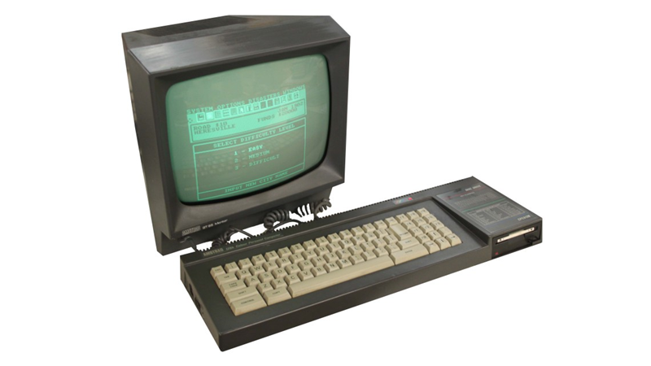
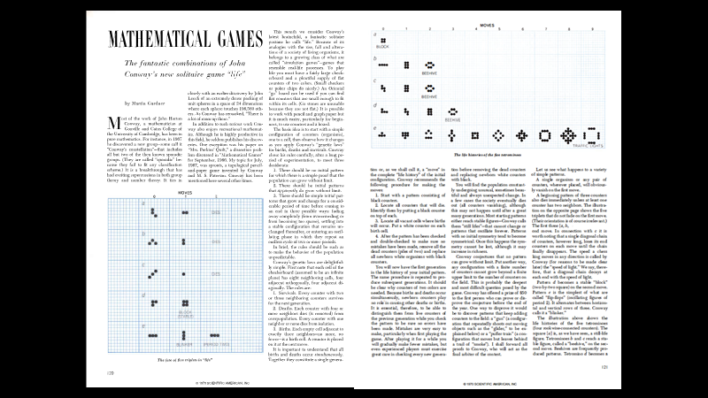

The first computer I ever had was one of these - the Amstrad CPC 6128. It was 1985, and I was seven years old. The Amstrad had a green-screen display, it had a 3” floppy disk drive, and it came with a handful of disks - there was a chess game, there was a game where you had to throw soap-suds at evil ghosts who’d taken over your launderette… none of them was terribly exciting. In fact, some of these games were so dull that the most exciting part of the whole process was getting them to run in the first place. But it also came with a programming language called LOGO - and LOGO was amazing, because you could use it to make the computer draw pictures. I would sit there for hours, figuring things out on scraps of paper, typing in commands from the manual - and trust me, the DR LOGO Amstrad Programmers Manual was not written for seven-year-olds - but when I cracked it, the thrill was addictive. I had made the machine do what I want.

That thrill has never gone away. The dopamine rush of solving the problem - the green test, the successful deployment, the moment where you finally figure out what's been causing that bug. And we’re all gathered here at BuildStuff in Vilnius to hear from some of the best and most brilliant people in our industry about all sorts of useful, important things  - microservices, information security, performance, user experience design, caching. But first, I want to talk to you all about something I love very much, something I think is every bit as important as as performance and security. I'm going to talk to you about art, and about making computers do things just for the sheer joy of watching it happen.

There’s a famous quote from Oscar Wilde - ‘all art is quite useless’. So maybe all of you coming here to listen to me today is a complete waste of everybody’s time… but then again, maybe Oscar Wilde was wrong. Because I don’t believe that art is useless. I’m with Douglas Adams here - ‘the function of art is to hold a mirror up to nature.’ And if we want to hold a mirror up to nature, first we’re going to need to invent the mirror.. and that, my friends, is where science and technology come in. 

For centuries, technology has given us tools to explore the world around us, to see and study things that no human being had ever seen before. We've built instruments to study the hidden world that's all around us - 
a world of microscopic monsters, plants and animals and entire ecosystems too small to see with the naked eye, hidden right under our noses until the first microscopes gave us a window into this strange and beautiful aspect of our reality. 

We've sent spacecraft to the moon, built satellites and telescopes that have showed us the planets, the furthest reaches of our solar system, and we've peered into the furthest corners of our galaxy and listened to the echo of the big bang, the aftershock of the very creation of our universe.

And within the last few decades, computers has given us the power to explore another secret world that’s hidden in the very fabric of our reality - a secret world of mathematics and information.
**[SLIDE: scientific American]**
Throughout the 1970s, the journalist Martin Gardner had a regular column in Scientific American magazine, where each month he'd share mathematical puzzles and curiosities with his readers. Of all the columns Gardner ever published, the one that had the greatest impact was undoubtedly that published in the October 1970 edition, where he introduced the world to something called Conway's Game of Life. Created by the English mathematician John Conway, the Game of Life was one of the earliest examples of something we call a cellular automaton.

As games go, Conway's Game of Life doesn't look like it has much to offer - it's a game with no players and only three rules, played on an infinite board. 

The board is divided into square cells, which are either living or dead. If a living cell has fewer than two living neighbours, it dies of loneliness. If a cell has more than three living neighbours, it dies of overcrowding. And if a dead cell has exactly three living neighbours, it comes back to life. That's it. That's the entire rules of the game. When Martin Gardner first published his column, readers would play around with the idea, drawing a couple of generations of Life on sheets of squared graph paper, looking for patterns.
They found some of the simplest patterns by hand - like the oscillator,
**[slide]**
 a stable configuration that jumps between two states, and the **glider**, a configuration that cycles through five repeating patterns but which actually glides across the grid as it does. But the 1970s also coincided with the widespread availability of graphical computer systems. The first graphical computers were only available to those people lucky enough to be working at universities or research laboratories, but by the end of the decade we started to see the first true microcomputers - machines like the Apple II and the Commodore PET.
And when those early computer hackers started using their computers to simulate Conway's Game of Life, they discovered a world of astonishing richness and beauty - all thanks to those three simple rules. They discovered a whole world of patterns - stable configurations, oscillators that would travel through three, four, five states and return to where they started. And they began asking questions. Could you create a pattern that would grow infinitely? In 1970, a team led by the renowned computer scientist Bill Gosper discovered the first **glider gun** - a stable, repeating configuration that repeated every XX cycles, and which would launch a glider every generation, sending a continuous stream of gliders off into the endless void of Conway's infinite grid.
The Game of Life was compelling, Addictive. People became obsessed with it, spending endless hours hunting for new patterns, new configurations, new behaviours. People began creating new analytical techniques to help them find and study the weird and wonderful world that Conway had discovered... and we discovered some incredible things. We created **entire fleets of spaceships**, as strange and wonderful as anything from the fictional worlds of Star Trek.
It gets weirder. You see, it turns out that by making those gliders collide with one another, we can actually use Conway's life to create logic gates. 
This pattern was discovered by XXX in YYY. At a glance it looks unbelievably complex - but this pattern is actually a logic gate. Using gliders as inputs - glider = true, no glider - false - we can use this to simulate basic logic operations. And, of course, if you can build logic gates, you can build computers... it turns out that Conway's Game of Life, an infinite grid of cells and a handful of simple rules, is Turing-complete, and you can theoretically translate any computer program into a pattern of cells and run it in the Game of Life. The most stunning example of this I've ever seen was a team who actually implemented the Game of Life - in itself.
Now, the Game of Life wasn't the only hidden universe that we could explore with the power of graphical computers. The Game of Life was just one of a myriad of systems that exhibited something which became known as 'stochastic behaviour from deterministic systems' - in other words, systems where you could clearly define and understand all of the rules, but which would then go on to exhibit the most wonderfully complex and unpredictable behaviour. During the 1970s, a handful of researchers around the world, completely unknown to each other and working in fields as diverse as weather forecasting and zoology, began getting our first glimpses of what would become known as chaos theory. Chaos theory would go on to have all sorts of useful real-world implications - today, we use it for long-range weather forecasting, we use it for data compression, we use it to analyse patterns in stock market prices and study congestion in traffic systems. But chaos also gave us another world of bizarre and beautiful information structures to explore - the set of mathematical shapes known as fractals.
Now, to understand fractals and the study of fractals - which we call fractal geometry - you need to get your head around one of the weirdest things that exists in mathematics, which is a number we call i. You see, one upon a time a bunch of mathematicians were sat around talking about maths, and specifically square numbers and square roots. You multiply a number by itself - say, 2 x 2, or 5 x 5 - and the result is a square. And 2x2 is 4, so 4 is the square root of 2. But the weird thing is that -2 x -2 is ALSO 4. Not minus four. Plus four. If you're wondering why... well, it just is. There's probably another universe where it isn't, but in the universe we live in, that's how numbers work.
So if 2x2 is 4, and -2 x -2 is also four, what number can you multiply by itself to get minus four? And this is where it gets a bit weird. Because there is no such number. It does not exist. And this is the point where most scientists would go 'splendid, we've proved it doesn't exist. Good job, everyone.'
But not mathematicians. Oh no. Mathematicians go 'ok, it doesn't exist - no problem. Let's imagine it does' and they just sort of thunder on regardless... and what's weird is that this impossible imaginary number, that they've just pulled out of thin air. actually works. The number they actually invented is called i - and i is defined as the square root of -1.  so 2i is the square root of -4, 5i is the square root of -25, and so on. And - as long as you're prepared to ignore the fact that all this is clearly impossible - you can use these imaginary numbers to do all sorts of fascinating mathematics.
There's a thing we call an Argand diagram, which is a sort of map of the real and imaginary numbers. The real numbers - you know, the ones you find in bank accounts and recipes - go across the horizontal axis, like this. The imaginary numbers - which also come in positive and negative varieties - go along the vertical axis like this. And all this space here represents what are known as the complex numbers. Complex numbers are kinda like project schedules - they have a real part, and an imaginary part, and they can lead to some wonderfully unpredictable things.
Now, we can do arithmetic with complex numbers - we can add them, subtract them, divide and multiply them. It's kinda fiddly, because we have to break them into bits, do separate arithmetic on the bits, and then combine them together again - kinda like a very simple map/reduce algorithm. But we can do it.
In 1918, two French mathematicians - Gaston Julia and Pierre Fatou - published a paper entitled *Mémoire sur l'itération des fonctions rationnelles -* "on the iteration of rational functions". Now I have not actually read this paper - partly because it's well over a hundred pages of incredibly dense mathematics, but mainly because I can't read French - but I do know that one of the things Julia and Fatou discussed in it was what happens when you take a complex number, feed it into a simple function, take the result, and feed it back into the same function.
When we do this with real numbers, we get some pretty predictable behaviour. For example, let's take f(x) = x / 2 - we're going to get a decay curve. If we start with 1, we'll get a half, a quarter, an eighth, and so on. If we take f(x) = x + 1, we get an arithmetic series = 1, 2, 3, 4 and so on. If we take f(x) = 2 - x, we get what's called a periodic function - start with 4, we get 2-4 = -2; put that back in, we get 2 - -2 = 2 + 2 = 4, and round and round we go.
But when we do this with complex numbers, we get all sorts of complex, unpredictable behaviour. The specific functions that Julia and Fatou were studying were of the form f(x) = f^2 + C, and they experimented with different values of C. What they found was that not only was it impossible to predict what a particular input was likely to do, but they also found that even the tiniest variations in the input would produce dramatically different results.
They had discovered something remarkable, but the only way they had to explore this strange phenomenon was to do calculations longhand - cranking complex numbers over and over and over to see what results they'd get. To analyse one single scenario could take hours.
Julia's work was celebrated - he was awarded the Grand Prix de l'Academie des Sciences in 1918 - but it remained an obscure footnote in the world of mathematics right up until the 1970s, when Julia's ideas were rediscovered by this man - Benoit Mandelbrot. Mandelbrot was born in Warsaw in 1924 - Poland represent! - his family moved to France in 1936, and after world war 2 he emigrated to the United States.
Mandelbrot spent most of his career as a research fellow at IBM, taking extended leaves of absence to teach at Harvard University. Mandelbrot was fascinated by the mathematics of everyday life - “Clouds are not spheres, mountains are not cones, coastlines are not circles, and bark is not smooth, nor does lightning travel in a straight line.” Towards the end of the 1970s, Mandelbrot was studying something he called 'roughness', and in the course of his research he came across Gaston Julia's work on rational functions.
But Mandelbrot had something Julia didn't... thanks to his position at IBM, he had access to some of the most powerful computers in the world. Now, this is 1970s, where 'most powerful' meant memory measures in kilobytes and perhaps a few thousand operations per second - but that was enough power to do in a few hours what would have taken Gaston Julia a lifetime. Instead of plotting a few painstaking data points at a time, Mandelbrot could pick one of Julia's functions and use the IBM computers to draw the entire data set.
Now, you remember the Argand diagrams we saw a few moments ago? Let's fire one up here. What Mandelbrot and the other pioneering researchers did was to split this diagram - known as the complex plane - into data points; one point per pixel. And for each data point, they'd crunch the same function over and over again and see whether the result would disappear off to infinity or not. They found that for any given constant C, there would be a set of points within the plane that did not diverge to infinity. Mandelbrot named this set of points a Julia set, so that every complex number was associated with a unique Julia set. Of course, there are an infinite number of possible complex numbers - in fact, there's an infinite number of real numbers between -2 and +2, and there's an infinite number of imaginary numbers between -2i and +2i, so you could say that the number of possible Julia sets is actually Infinity times Infinity, which is a bit of a struggle for our feeble human brains to comprehend, but JavaScript assures me that Infinity times Infinity is still Infinity so I’m sure that’s alright.
But Mandelbrot had an idea. What if, instead of choosing some constant, he fed each point back to itself, over and over and over again? Choose a point on the complex plane - a pixel on our diagram - square it, add it to the result, square it again, add the original value again, and see what it does. If it vanishes off to infinity within a certain number of cycles, then that point is NOT part of our set, so paint the pixel white… but if it doesn’t, paint it black, because that pixel is part of something astonishing. It’s part of a bizarre, strange, beautiful shape that’s been called the ‘most complex object in nature’ - and which most of us know as the Mandelbrot set.
The earliest visualizations of the Mandelbrot set were drawn using text-mode terminals, with blank spaces and @-signs standing in for black and white pixels, but as computers got faster and more powerful, we’ve been able to explore this strange and wonderful shape in astonishing detail. In the mid-1990s, computers became powerful enough that we could render the Mandelbrot set in full colour. 
Actually, that’s not true. Technically, the Mandelbrot SET is the bit in the middle - that sort of weird sideways snowman shape with all the crinkly bits - and what we’re doing is coloring the points immediately outside the set based on how quickly they diverge. Points that zoom off towards infinity within a few cycles are deep blue, points that take a little longer are purple, points that take longer still are red.
But the most astonishing thing about the Mandelbrot set is that the deeper we dig, and the harder we look, the more we discover. That simple formula = z => z^2 + z - is a doorway into infinite world of complexity and beauty. It never runs out. The video playing behind me is a deep zoom Mandelbrot sequence that starts with the entire set and magnifies it 10^200 times. At 10^1 times, the original set is the size of this room. At 10 ^ 2 times, it’s the size of the building. 10 ^ 3 times, the original set is the size of this city block. 10 ^ 5 times? That’s a 100,000 times zoom. The original set is now larger than Krakow. 10^7, the original set is bigger than Poland. 10^9, the set is bigger than Europe. 10^12, we’ve zoomed in so far that the original set we started with is now larger than planet Earth.
Some people have referred to the Mandelbrot set as ’the fingerprint of God’. Now, I’m not a religious man… but I do find something deeply spiritual, and incredibly reassuring, about the Mandelbrot set. This astonishing shape, with its infinite depth and complexity and beauty, is not something anybody designed. It’s something we found. Something that has been hidden, buried inside the mathematics that shapes our universe. And it was buried WELL - to discover it, we had to invent arithmetic. We had to evolve imagination and creativity - the intellectual capacity to conjure imaginary numbers out of nowhere, to ignore the fact they’re impossible and learn how to manipulate them. And then we had to invent computers, thinking machines that could perform the thousands of millions of calculations a second that are required to map this amazing mathematical landscape and put it up on a screen where we can see it. Perhaps it’s like an Easter egg, hidden in the fabric of our reality to let us know we’re on the right track… or perhaps it’s just one of those weird things that happens sometimes. 
Of course, this is 2019, and computer graphics is everywhere. There’s no longer anything remotely remarkable about seeing something on a computer screen - or a cinema screen, for that matter. In 1982, Disney released TRON, the first motion picture to use computer graphics to create special effects - and it seems incredible now, but the reason TRON didn’t win an Oscar is that it was banned from the visual effects category by the Academy, who considered that using computers to create movie special effects was ‘cheating’. In 1986, Pixar released Luxo, Jr - the first film created entirely using computer animation. From the dinosaurs in Jurassic Park, to Woody and Buzz in Disney’s Toy Story, to the epic fantasy battles of the Lord of the Rings movies, computer generated imagery - CGI - has smashed one milestone after another. In 2016, Industrial Light and Magic used CGI to create a digital version of the actor Peter Cushing, who died in 1994, and recent advances in machine learning and digital image manipulation have produced so-called ‘deep fake’ technology. It’s not inconceivable that within the next ten years you’ll be able to unlock your phone and say ‘hey Siri - make me a video of Friends except every character is played by Nicolas Cage’ and boom! it’ll just do it. 
But machine learning has also introduced us to another completely new kind of art, that’s that is every bit as bizarre and wonderful as fractals. 
You ever lie on your back in a field as the clouds drifting by on a summer day, and watch as your mind turns the clouds into all sorts of recognisable shapes - a rabbit, a dog, a smiling face? That’s pattern recognition in action. It’s one of the things that our brains are really, really good at - and building machines that can do that same sort of pattern recognition is the fundamentel basis behind modern research into computer vision. We build things called convolutional neural networks - we build layers upon layers of algorithms, each looking for specific patterns, shapes and boundaries. Then we train them on thousands of photographs - these pictures are dogs, these pictures are not dogs - and the layers of algorithms reinforce and modify each other until we don’t really have any idea how they work any more. But if we’re lucky, we end up with an algorithm that can tell the difference between, say, a chihuaha and muffin. Which is actually a lot harder than it sounds.
But what happens if we reverse the process? Let’s take our dog-detector and turn it into a dog amplifier - we’ll feed a random image into it, and get our neural network to find things that it thinks look like dogs, and then enhance the dogginess of those details… and then, in time-honoured tradition, we’ll take the output and feed it back into the same function. After a few iterations, things start to look a little weird. After a few dozen iterations, things get positively psychedelic.
The first program to do this was developed by Alexander Mordvintsev at Google in 2015. That program was known as Deep Dream; the technique it pioneered is now widely known as ‘deep dreaming’, and the bizarre, disturbing images it creates are known as ‘deep dreams’. The reason they’re so unsettling is that these kind of images fire all of those pattern recognition routines that are wired into our brains - they’re like walking through a forest at night, where every tree looks like a dangerous predator until you look at it properly and realise there’s actually nothing there.
I have no doubt that as augmented and virtual reality become more widespread, we’re going to see more weird and wonderful computer-generated art; the power to create truly immersive environments opens the door to a whole new kind of experience - we’re no longer sitting looking at an image on a screen; the viewer becomes an integral part of the experience - and like almost every invention and innovation in history, there will be people who try to use it to make the world a better place, there will be people who try to to use it for gain and profit, and there will be people who just want to use it to create art, to push the boundaries of human experience just to see what it feels like.
Now, we’ve talked so far about using computers and computer programs to create art - you write the code, you run the code, the code produces some kind of output, and then you show people that output and everybody goes ‘wow, that’s amazing’. Or accuses you of cheating and bans you from the Oscars, if you’re the team who created TRON - I guess some people just don’t appreciate great art when they see it.
But what about if running the code isn’t the point? What if the code itself is an art form? Our industry has debated this for years… from the title of Donald Knuth’s classic book ’The Art of Computer Programming’, first published in 1968, through ongoing discussions around whether programming is a scientific, or a creative, or an engineering discipline… but even those kinds of discussion tend to be about writing useful programs that do things. And I don’t know about you, but sometimes I get a bit bored of talking about refactoring microservices and HTTP caching headers… and that’s when I go looking for crazy code. Code that not only doesn’t do anything important, but code that’s so wonderfully weird that if anybody actually tried to use it in production, they’d probably get fired. 
I’m sure you’ve all had those days when you’re digging through some legacy code or reviewing a pull request and thinking ‘what the heck does this even DO?’ - and then eventually it clicks, and you’re like, ‘but… why? Why would anybody EVER write code like this?’ Well, imagine if there were people out there who were actually writing that kind of code, on purpose… to win a contest.
The first International Obfuscated C Code contest was held in 1984. The rules of the contest were simple: your source code file had to be a C program no more than 512 bytes long, with credit awarded for “violations of structured programming and non-clarity”. 
The contest has been held almost every year since then - and some of the entries are absolutely delightful. Take this one - buzzard.c, submitted by Sean Barrett back in 1991. That’s the entire source code there… for a 3D ASCII-art maze program that you have to solve by navigating around it using the l, r, and f keys. Oh, and the layout of the maze is the program’s own source code.
Or there’s this absolutely wonderful example from 2015. Here’s the source code. The ENTIRE source code. That’s it. Do you know what it does? No, of course you don’t… to work out what’s going on you’d have to spend at least a couple of hours trying to figure out what it actually does. So let’s build it and run it… and, of course! It’s Flappy Bird.
I love obfuscated coding contests, not just because they’re fun, but because every year or two, as computers and networks and standards get more sophisticated, people come up with new and wonderful ways of doing incredibly clever things with the most minimal amounts of code. This next example is in JavaScript - that’s it. That’s the entire application - there’s no jQuery, no React or Angular or external libraries, no nested DIVs. And here’s what you get when you open that in a browser. It’s called Nanochess, by a guy called Oscar Toledo G. Oscar has won the Obfuscated C contest more times than I can count - he won in 2005 with a C version of his chess program, written in less than 1k of C code - you wanna see the source code? Isn’t that special? And now, fourteen years later, thanks to things like having the entire set of chess symbols built in to Unicode, it’s possible to create a chess game in less than a kilobyte of JavaScript. And when I say a chess game, I mean a game that can actually beat me at chess. In a kilobyte of JavaScript.
Now, in 1994, Szymon Rusinkiewicz won an honorable mention in the International Obfuscated C contest for submitting a singular and remarkable program. The program was called smr.c, and it claimed to be the world’s smallest-ever self-reproducing program. Here’s the source code for smr.c:
Yep. It’s an empty file. And it worked because, back in 1994, there were a handful of C compilers floating around that, if you asked them to compile an empty file, they’d produce a valid program which created no output - and so, in a manner of speaking, Rusinkiewicz had indeed created a program that produced its own output.
And that’s actually a fascinating idea. Take a moment to think about it - in your favourite programming language, could you write a program that produced its own source code as output? Now, you can’t cheat - you can’t just read the source code file and write that back to STDOUT. That wouldn’t be any fun at all… 
A program that produces its own source code as output is known as a quine - the name was coined by Douglas Hofstadter in his book ‘Godel, Escher and Bach’ in 1979, after a guy called Willard Van Orman Quine, an American philosopher and mathematician, who studied self-referential logical statements. 
Quines are, of course, completely useless - but creating them can be a lot harder than it looks. Let’s build a quine in C#.
OK, so it’s a Program, with a static void main() method, that’s going to print… what?
Well, it needs to print a Program, obviously. With a static void main() method, that prints a program, that prints a static void main method, that… 
But hang on a second. What if we put our program into a string, and print it twice? Well, it turns out in .NET we can use a feature called string templating to print a string that contains itself - effectively saying “hey, print this string S, but when you see {0}, replace it with the first argument” - which is, of course, the string S. 
Now, some languages are better suited to writing quines than others. JavaScript, for example, is brilliant for writing quines, because JavaScript functions can refer to themselves, AND have a built-in toString() method that’ll return their own source code as a rather convenient string. If you’re running ES6 JavaScript, you can actually create a quine in 21 bytes:
$=_=>`$=${$};$()`;$()
It’s even possible to create quines in languages like x86 assembler - there’s a website called Rosetta Code, where people share their solutions to common problems in different programming languages, and the quine page on Rosetta Code has some truly delightful examples.
But one of my favourite examples ever was created by a guy called Leon Bambrick, who set out to answer the question - can you create a quine using HTML and CSS? That is, can you create a web page that renders its own source code?
Well, let’s have a go. 
[INSERT HTML QUINE WALKTHROUGH HERE]
Like I said, quines are useless. What’s the point of computer program whose only function is to give you some source code that you’ve already got? But that’s the thing about art - just because the end result doesn’t serve any practical purpose, it doesn’t mean it was easy to get there. Writing a quine can be a great way to really understand the capabilities and constraints of a programming language.
Now, take a look at this - anybody know what language this is written in? That’s right. It’s Haskell. Not particularly idiomatic Haskell, admittedly - but when you compile and run it, you get this…. that looks kinda like Python, doesn’t it? What happens if we run that? Ooh - look at that! Ruby! Let’s run it!
And… wow, is that our original Haskell program back again? This is what we call an iterating quine, or a quine relay - sometimes known as an uroborus quine, after the mythical serpent that eats its own tail. There’s examples out there of uroboros quines that loop through three, four, five languages… but how about this? Anybody want to tell me what language this is written in?
Well, there’s a clue - that first line starts with a hash define, right? So it’s probably a C program? Let’s try that.
But wait a second… in languages like Ruby, a hash means a comment. I wonder what the Ruby interpreter will make of this… look at that. It prints its own source code. But hold on a second, that def printf with a colon after the arguments, that looks kinda like Python, doesn’t it?…
This program was created by a Japanese developer called Shinichiro Hamaji - known as shin - and it’s a polyquine - it’s a valid program in C, Python, Perl, Ruby and PHP (and technically C++ as well, if you disable a specific compiler warning about main not returning int). Shin’s GitHub repository is full of weird and wonderful things, including this. This file contains a FizzBuzz program in Ruby, a FizzBuzz program in Perl, a FizzBuzz program in Befunge - and it’s a bootable x86 filesystem image, so you can actually boot a virtual machine off this file and it’ll run FizzBuzz. Oh, and it’s also a valid GIF file…
Now, Shin - the creator of these examples - is definitely a genius, and probably a genius with too much spare time. But my personal award for the most mind-blowing creative misuse of programming languages goes another developer from Japan, Yusuke Endoh. Yusuke is one of the core Ruby language team, and has won the international obfuscated C code contest numerous times, but amongst all his projects, the one that stands out to me is this one.
Some of you might see the odd fragment in this source code that you recognise… there’s a System.Console.Write in there, and an object QR extends App. But there’s also some WEIRD stuff… Act i, Scene i, Enter Ajax and Ford - that looks like the script for a play?
This is a 128-language uroborus quine. It’s a Ruby program that creates a Rust program that creates a Scala program that creates a Scheme program… that loops through 128 languages - IN ALPHABETICAL ORDER - and ends up producing the original Ruby program again. Let’s zoom out a bit and have a look at the complete source code.
And the fun part is it that not only does it come with instructions on how to run it, but as of August 2019, there’s actually a continuous integration build for this program using GitHub Actions - yep, in all 128 languages.
Now, let’s rewind a second… what, exactly, was going on with Ajax and Ford in the source code there? Well, Mame’s 128-language quine relay doesn’t just include all the sensible languages that we know and love, like C and JavaScript and Visual Basic - it also includes a few dozen computer langauges that are art forms in their own right.
We call these esoteric languages - esolangs for short. And they are every bit as weird and wonderful as anything else we’ve seen so far in this talk. Those little snippets of code in Mame’s quine relay that look like stage directions come from a programming language called Shakespeare. Shakespeare was specifically designed to let you create computer programs that look like plays - specifically, like plays that could have been written by William Shakespeare. Variables in Shakespeare have to be named after actual characters from one of Shakespeare’s plays; programs are structured into Acts and Scenes. Constants in Shakespare are created using nouns and adjectives. Nice nouns - like flowers and angels and a summer’s day - have the value 1. Negative nouns - pigs, wars and the Devil - have the value -1. And every adjective multiplies the value by 2, so a flower is 1, a blue flower is 2, a sweet blue flower is 4, a fair sweet blue flower is 8, and so on.
Let’s take a look at Hello World in Shakespeare. Our program must have a title, and a dramatis personae - where we declare the variables we’re going to use. Act 1, Scene 1 - The Insulting of Romeo. And at this point Hamlet goes on a bit of a rant… and each of his little insults is assigning a value to the variable Romeo, and then each time Hamlet says ’Speak your mind!’, the program prints the current value of Romeo. And so, very slowly, we get H… e… l… l…. o… 
Now, there are literally hundreds of these esoteric languages - ranging from the inspired to the downright evil. One of the earliest esolangs was INTERCAL, designed in 1972 with the goal of making a language that had absolutely no features in common with any other existing programming language. The only arithmetic operator in INTERCAL was a bitwise interleave operator, and the only output format it supported was Roman numerals. Whilst language designers were arguing about the GOTO statement and whether it was a good idea or not, INTERCAL implemented the opposite - a COME FROM statement. The idea being that somewhere in your program you’d have a labelled statement say, FOO - and then somewhere in a completely different file you’d have a COME FROM FOO instruction, and when you ran your program and it reached FOO it would just bounce off to wherever the COME FROM statement was without any warning. This is clearly a really bad idea… I’m sure the fact that it’s disturbingly similar to how we write event driven JavaScript here in 2019 is just a coincidence.
There’s the programming language called Whitespace, which only uses whitespace - everything other than tabs, spaces and newlines is ignored. A space character pushes a number onto the stack, a space followed by a tab will substract the top two values from the stack… you get the idea. There’s a program language with a very rude name indeed, often abbreviated to BF in polite company. BF has exactly eight commands, and ‘Hello World’ in BF looks like this:
++++++++[>++++[>++>+++>+++>+<<<<-]>+>+>->>+[<]<-]>>.>---.+++++++..+++.>>.<-.<.+++.------.--------.>>+.>++.
There’s one more esoteric language I want to show you, because this one’s so weird you can argue about whether it’s even a programming language. It’s called Piet, and it’s designed to let you create executable art. The instructions in Piet are not keywords or symbols - they’re colours. Literals and constants are declared using coloured blocks of a particular size, and to ‘execute’ the program, you start at the top left corner with an execution ‘cursor’ that moves around the program, turning left and right and manipulating the stack as it goes. Here’s an example of a Piet program that prompts the user for a number and calculates its square:
[PIET EXAMPLE]
So… we’ve looked at programs that create art, we’ve looked at programs which are art, and we’ve looked at programming languages that are intended to create art… but everything we’ve looked at so far is disconnected. Prerecorded. The programmer does some work, publishes their source code online, and at some point later, somebody looks at it and goes ‘ooh, that’s pretty.’ But art isn’t just about creation. Art is also about performance - our ancestors painted on cave walls, but they also told stories and sang songs. Paintings and sculptures and movies are exciting but there’s a particular thrill about live performance - about watching musicians and dancers and actors doing something LIVE, real time, where the audience almost becomes part of the process.
Now, any time you go to a software conference like this one, you’ll probably see some live demos - somebody’s up on stage with their laptop, and they’re writing code up there, with all those people staring at them, and maybe the wi-fi’s not working quite so well or maybe Microsoft just pushed another massive preview update to .NET Core and it’s broken all their demos… we’ve all seen that, right? That spontaneous round of applause when somebody’s just built an entire web server live on stage, in fifteen minutes, and they press F5 and it actually works? It’s kinda exciting, right?
Now, I normally have a rule about live demos. I don’t like doing them, because there’s so many things that can go wrong, and I don’t want a room full of people coming to one of my talks to learn about JavaScript or hypermedia and all they actually learn is that I’m not a very good typist and none of my demos work without wifi. See, when we think about software as an engineering discipline, there’s a huge emphasis on reproducibility. Anything happens more than once, we automate it. Testing? Write unit tests and integration tests. Compilation? Create a Makefile or some build scripts. Deployment? Script it. Infrastructure? Move it all to VMs so we can automate everything. And we have this word ’snowflake’, which is kind of a derogatory term… you know. A ’snowflake server’ is that old Dell Poweredge that’s still downstairs in the server room. Unique, hand-crafted, with JUST THE RIGHT set of DLLs to run your legacy applications - and woe betide anybody who even DARES to install Windows Updates on it.
We call them snowflakes because they’re unique, because no two snowflakes are ever alike. But snowflakes are also beautiful, and ephemeral - you catch a snowflake on your hand and, just for a few seconds, you can see something that nobody else has ever seen… and then it melts, and it’s gone, forever, and all that’s left is that memory of the experience. And that’s the beauty of live performance - even if it’s recorded, even if there’s video and photos, those things will never capture what it was like to be part of it when it was actually happening.
I have a good friend back in London, a guy called Liam Westley who some of you may know - he’s spoken at NDC and various other conferences around the world. And Liam has a fantastic story about being hired way back in the late 1990s to create some software to do computer graphics for a TV broadcast. There was going to be a general election and they wanted some fancy computer graphics as part of the live TV coverage as they reported the election results. 
So Liam gets this specification for a really complex software app - which, being 1997, was going to be written in Visual Basic 6. They need screens to enter results, regenerate the graphics, export images, all sorts of things. And, of course, they need time to test everything and sign off on the release and install the software and…
and Liam goes back to the client and says ‘you’re going to use this software ONCE, right? There won’t be another election for five years (this was back in the days when British democracy wasn’t a screaming bin full of burning tyres) we need to use this once, one night, for a live TV broadcast, and then you’re basically gonna throw it away?’ And the client says ‘yeah’… and so here’s what they did.
Liam and his team built a Visual Basic 6 app that took some numbers, and drew a graph. They put a splitter cable on the monitor output of the computer, and ran the other one directly into the live TV broadcast feed, then they put breakpoints on most of the variables, and ran it. And waited. And every time a phone call came in with some fresh numbers, they’d edit the variables - directly in code - and click ‘Continue’, and the graphs would update. And that was it. No unit testing. No release process. If anything went wrong - didn’t matter, this was live TV! The station would just cut to a different feed for a few minutes whilst they fixed it.
I absolutely love that story, because by any rational definition of software ‘engineering’, it’s so absolutely the wrong thing to do. No tests, no monitoring, developers hacking code in production every time the phone rings, with a few million people watching it happen in real time. But for that particular scenario, it was absolutely the right way to solve the problem. And that got me thinking, a lot, about the idea of using computer code as part of a performance… and that brings us on to the last and final part of this talk.
This is Dr. Sam Aaron. Sam is a researcher, programmer and educator, who created a truly remarkable piece of software - a thing called Sonic Pi. Sonic Pi is a programming environment that uses a domain-specific language to let you perform music - live, on stage, in real time.
When you first fire it up, Sonic Pi looks like this - there’s ten code buffers, a built-in tutorial, and this area here where you can start entering some code.
[5 minute demo of Sonic Pi -TBC]
Now I’d like to end by wrapping up a bunch of these ideas and show you something of my own. You see, my two great passions in life are code and music. I love writing software and being a developer, and I love to create and perform music. When I was maybe fifteen years old, I was absolutely set on being a musician - until I found out that most musicians were constantly broke and kept having to sell their guitars to pay the rent, but computer programmers got paid LOADS and they could buy as many guitars as they wanted… and so I sort of drifted into IT and software and, well, I’m still here. And there’s this one phrase that crops up in our industry from time to time… the idea of the ROCKSTAR DEVELOPER. You’ve heard of the Rockstar Developer, right? You’ve definitely seen the job adverts ‘rockstar developer wanted’ - another company that’s in the middle of a self-inflicted meltdown, that still seriously believes that everything would be OK if they could just hire that one amazing individual who will solve all their problems with their superhuman coding skills.
Then last year, Paul Stovell, the creator of Octopus Deploy, shared this on Twitter:
Have you ever had one of those moments, where you see an opportunity and think ‘THIS IS IT! THIS IS MY TIME! THIS IS WHY I’M HERE! IT ALL MAKES SENSE NOW!’
It was so clear. It was so obvious. What the world needed was a programming language where all your programs could be big cheesy rock songs 1980s power ballads.
So… I started playing around with some ideas. Now, I had a bit of a head start in this particular area, because back in the glory days of the first Dotcom bubble, I spent a lot of time working in a couple of programming languages that included a lot of very weird language features. One was VBScript, the other was Perl. It turns out that when you understand the language syntax of Perl, trying to compile Meatloaf songs is actually pretty easy.
The first draft of the Rockstar programming language spec was written in a bar. And it shows. Rockstar supports two kinds of variables - common variables and proper variables. Common variables are prefixed with the keywords a, an, the, my or your. Proper variables are one or more words, where each word begins with a capital letter.
We support string literals and numeric literals, and assignment is done using the Put/Into keywords.
One interesting challenge I had with the language design was how to handle single quotes. You see, rock musicians have literally no idea what the apostrophe is for, and so they sort of sprinkle it all over the place at random. So I had to come up with some pretty weird rules that would allow you to use phrases like ‘ain’t talking’ bout’ love’ in your programs. After all, in rock’n’roll that’s a perfectly valid string.
Then we get to the fun part - a feature called poetic literals. I wanted to find a way to initialise numeric values without having to type literal numbers into the program - I mean, numeric constants aren’t really very rock’n’roll. So I came up with the idea of using word lengths in place of digits. Using the keywords is, was or were, Rockstar will parse the rest of the line by taking the length of each word, modulo 10, and assigning the resulting decimal number to the variable in question.
So where as in JavaScript you’d write var pi = 3.14159, or in C# you’d write decimal pi = 3.1415926535m, in Rockstar you can write
My dreams were ice. A life unfulfilled; wakin’ everybody up, taking booze and pills.
There’s no brackets, braces or indentation; blocks are ended with a blank line, and the end-of-file will end all open blocks. 
I added a bunch of similar features to support functions, comparison, increment - until the point where I had enough of a language spec to implement FizzBuzz. Then I stuck it up on GitHub, tweeted about it, and went to bed.
[Tweet screenshot]
This is where it gets interesting. Within 48 hours, it was on Reddit and Hackernews. Cory Doctorow wrote about it on Boing Boing. And then people actually started to implement it. And make suggestions. And file issues. And create things like syntax highlighters.
It even made it into Classic Rock magazine. That’s a proper music magazine that’s absolutely nothing to do with tech, but I got this email out of the blue from an actual rock music journalist saying ‘hey - someone sent me a link to your Rockstar project; it looks pretty interesting - can we do a feature on it?’. 
Eventually, I reached a fairly daunting conclusion… the only way to really do this properly was that I was going to have to build my own Rockstar compiler. Now I hadn’t built a parser or compiler since University, and that was a LONG time ago… so over Christmas 2018, I dug out some old textbooks and some articles, and I created an online Rockstar interpreter - it’s written in JavaScript, so you can run it directly in your browser, and so anybody who wants to can become a certified Rockstar developer. 
Now, the story of how I did that is a whole other talk, so if you want to hear that you’ll have to ask the DevConf crew to invite me back next year 🙂 
But the real test of Rockstar is - is it genuinely possible to write a computer program that’s also a passably good example of a rock song? Now, you remember a few moments ago when we were playing around with Sonic Pi, and I showed you how to implement FizzBuzz? Remember that catchy little melody? Well… let’s see what happens when we turn it up to eleven…
[FIZZBUZZ LIFE PERFORMANCE]