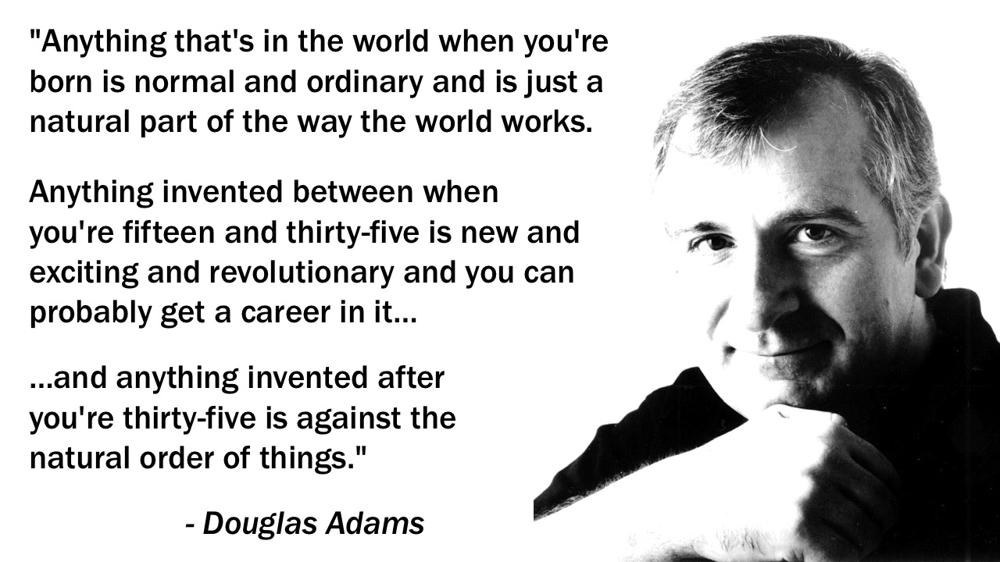
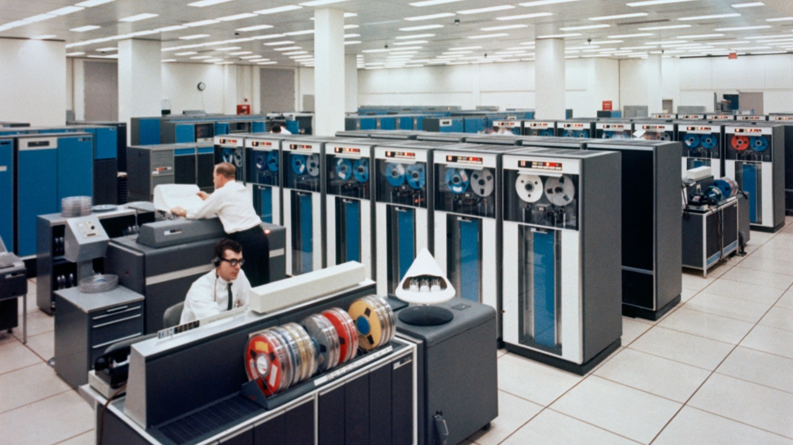

The author Douglas Adams once came up with a set of rules to describe the way the world works:

My name is Dylan Beattie, and I'm a nerd. Now, I was born in 1978. I was born into a world where computers already existed, and a very few people even had a computer at home. The telephone network existed, computer networks existed. The Internet existed - although many of the internet technologies we take for granted today, like email, DNS and the world wide web, hadn't been invented yet. But according to Douglas Adams, those are the things that were just a normal, ordinary part of the world I was born into.

The World Wide Web was invented around the time of my fifteenth birthday - in fact, there's this wonderful Usenet post floating around somewhere that was originally posted on my sixteenth birthday - it's some guy called Jeff Bezos looking for a programmer to help him launch a new startup. And the web was exciting, and it was revolutionary, and I did get a career in it.

Things that were invented after I turned thirty-five – and are therefore against the natural order of things – include smartwatches, fidget spinners – and AngularJS. 

But I think what Douglas Adams was getting it, with that observation, is that as humans, our experience of technology and innovation is incredibly subjective. There's another Douglas Adams quote I like: "technology is stuff that doesn't really work yet" - and that's true, isn't it? Most of us here work in what we call tech - technology - and we deal with bugs, and outages, and dependency conflicts, and data breaches all the time. Things that just work - like chairs, and plumbing - aren't technology any more. They're just stuff.

And that's the difference between the magical and the mundane. The hacks. The innovation that happened before you were born was somebody else's technology. The innovation that happens when you're starting out in your career is exciting - you're doing stuff nobody's ever really tried before. And when you turn thirty-five, you're fed up of things breaking all the time and you just want stuff to work properly.

But all this stuff around us - music players, cars, painkillers, air travel - it all started out as experiments. It all started out in labs, prototypes held together with blind faith and gaffer tape. 

And it is all too easy to think that people are rational, that capitalism fundamentally works, that there's some sort of technological Darwinism at work here – that the technology which has survived, the things we rely on and use every day, was somehow the best solution to the problem and that's how it became so ubiquitous.
But no. That's not how history works. For every brilliant innovation that succeeded, there's a dozen equally brilliant ones that never made it out of the lab. For every company that becomes a household name, there's a dozen that nobody ever heard of. And in so many cases, the reasons for this are the most trivial things. Bad luck, serenditipity, timing. 

What I want to talk about today is those tipping points. The key moments in the history of technology, and particularly the world wide web, where things could so easily have gone the other way, and to look at how profoundly different our world and our lives might have been.

And we're going to start off back in the 1970s... because in the beginning, there was... the mainframe.

A computer so powerful that Thomas J. Watson, the president of IBM, believed that the world might need as many as five of them - one for each continent.

Now, in the 1970s, IBM dominated the computer industry to an extent that it's almost impossible to comprehend today. Their mainframe computers were absolutely ubiquitous, and the company was so big it was practically invincible. But that sort of scale comes at a cost. Companies that are hard to disrupt also find it impossible to innovate - their sheer scale gives them a sort of corporate inertia that makes it almost impossible to do anything quickly.

Towards the end of the 1970s, the first credible threat to IBM's monopoly appeared on the scene - and it wasn't another mainframe company. It was hobbyists, people like Steve Jobs and Steve Wosniak, selling cheap computers that were so small you could actually fit one in your house. 

This scared the crap out of IBM. And they were smart enough to realise that International Business Machines' standard operating procedures were never going to compete with two guys in a garage who didn't even wear shoes, so they did something incredibly astute. They took a small team of their best engineers, gave them an unlimited budget, and told them to create a home computer. And it worked - a few months later, the world was introduced to the IBM PC. 

The only way to get the PC to market that quickly was to outsource almost everything. They bought their processors from Intel. They bought their disk drives and serial ports from manufacturers in Taiwan and China... and when it came to operating systems, they went to see the best software company in the world – and we'll see shortly who that was.

Now, while IBM are inventing the personal computer, there's also a bunch of interesting stuff going on with computer networks. There's already an international computer network - ARPANET - but it wasn't terribly big. In fact, I have a map of the entire ARPANET here, from 1973 - you might even recognise a few names on there, like Stanford and MIT. 

In 1981, the Internet Engineering Task Force published the specification for something called the IPv4 - the Internet Protocol, version 4. Together with the accompanying Transmission Control Protocol - TCP - it's quickly adopted, and January 1st, 1983, is designated FLAG DAY - the day when TCP/IP becomes the official protocol for the ARPAnet. For the first time, all the connected computers on the planet are speaking the same language. But it turns out when you connect all the computers on Earth together, you create a whole new set of problems.

They say there's only two really hard problems in computer science - cache invalidation, and naming things. OK, and off-by-one-errors.   

