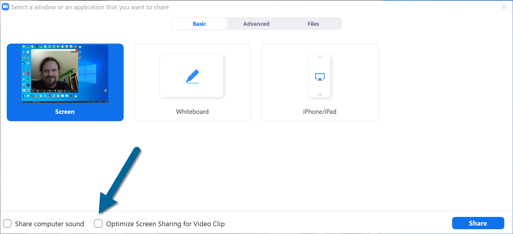
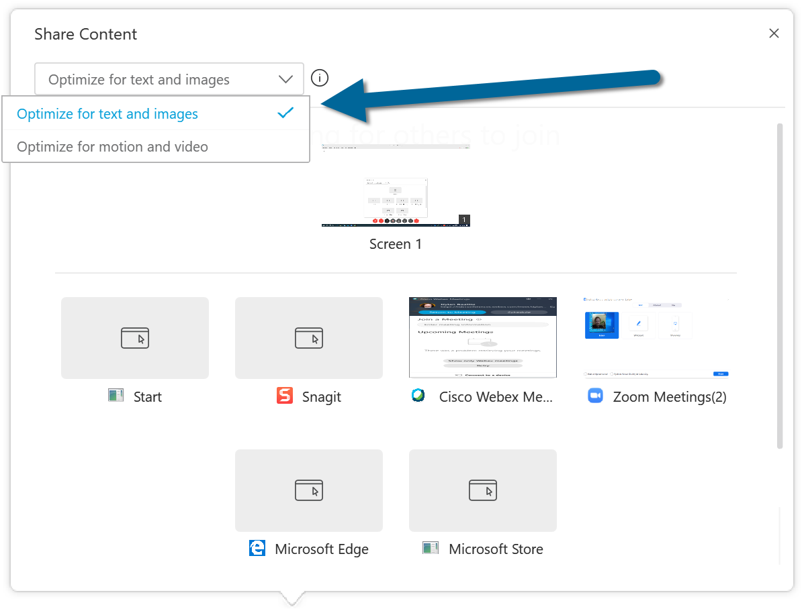

As we enter the third month of the global lockdown, more and more events are exploring online conferences as an alternative to postponing or cancelling, which means more and more speakers are being asked if they'd be able to do their talks as an online session presented over a live stream. 

Since I got back from the (physical!) Fusion meetup in Birmingham on March 12th, I've spoken at four virtual meetups, presented six talks at four online conferences, and helped the crew from NDC turn Copenhagen and Porto into virtual events. I've experimented with a ridiculous amount of gear - old and new - and I've talked with hundreds of speakers about the challenges we're all facing to adapt our material, turn our homes into impromptu broadcast studios, and keep on delivering great content and inspiring presentations even when we're all locked down for the foreseeable future.

Lots of people have asked me for tips on this - so here it is: everything you ever wanted to know about online presentations.

## Test All The Things

First - the absolute, cast-iron, golden rule of online presentations: **Test everything. Test, test, test.** It doesn't matter how good you are in your room - what matters is what your audience can see and hear. Figure out how to see through your own camera, how to listen to your own microphone, how to see your own screen share. Put yourself in your audience's shoes and see how much of your content actually makes it out the other end - and then tweak, improve and adapt until it's perfect.

With that in mind, here's my top ten tips for doing great online presentations.

## Rehearsal 1: Content

This sounds obvious, but it's easily overlooked. Remote isn't just another conference stage, it's a completely new format. Even if you've done a talk a dozen times, the first time you do it remote, it's going to freak you out. Rehearse. Do your talk by yourself, in the room where you're going to be presenting. Don't worry about equipment yet - this is about content. Rehearse until you can deliver your talk flawlessly, to a blank wall that doesn't laugh at any of your jokes or raise a hand for any of your questions. If you can handle that, you can handle anything that a virtual conference is going to throw at you.

## Microphones

A conference is about **speakers** giving **talks**. Not looks, not stands, not dances - **talks**. We are speakers, we are there to talk, and our audiences are there to listen. If your audience can't hear you, you've lost them, no matter how beautiful your slides or or how many hours you've spent practising – and when you're presenting online, your microphone is the [Jesus nut](https://en.wikipedia.org/wiki/Jesus_nut) – the single point of failure that can bring the whole thing crashing down.

You can easily spend a [fortune](https://www.thomann.de/gb/large_diaphragm_mics.html?oa=prd) on specialist microphones, but if you don't know what you're doing, it won't make any difference – and if you *do* know what you're doing, you can get great results from relatively inexpensive kit.

You want the mic as close to your mouth as you can get it - between 2" (5cm) and 6" (30cm)  is ideal - and as far away from any other source of noise as you can. The mic that's built in to your laptop is not going to cut it. It's at long way from your face, it's right next to your keyboard - which means every keystroke sounds like a tap-dancing elephant to all your listeners - and being built in to your laptop means it's probably on a nice big desk or table that'll pick up noise and vibration from every footstep and passing car. 

So the built-in mic in your expensive laptop is a no-no – sorry! – but like I said, that doesn't mean you need to buy expensive equipment. Even just the earphones that came with your phone are a thousand times better - plug them in, make sure the cord microphone isn't catching on your collar or rubbing on your jacket. If you have an external webcam, many of them have a reasonable microphone built in that works OK if you stay relatively close, don't move around too much, and keep looking straight at it. I've also had good results using a gaming headset with a built-in microphone, and with a set of Bluetooth earphones I bought for the gym. 

The golden rule with any microphone, though is: **listen to yourself.** Grab a copy of Audacity, and make sure to listen through headphones. Record 30 seconds of silence and listen back to it. What do you hear? Traffic noise? Dishwasher? Mouse clicks? If you can hear it, your audience will hear it. You might not able to eliminate background noise entirely, but figure out what you can to reduce it - close windows, close doors, take off your shoes, switch off the aircon. Make yourself a pre-flight checklist.

Now record 30 seconds of you speaking. at the same volume you'd use when giving a talk, and listen back to that. Try reading these ten sentences out loud, then listen back and see what you sound like:

1. The dark pot hung in the front closet.
2. Carry the pail to the wall and spill it there.
3. The train brought our hero to the big town.
4. We are sure that one war is enough.
5. Grey paint stretched for miles around.
6. The rude laugh filled the empty room.
7. High seats are best for football fans.
8. Tea served from the brown jug is tasty.
9. A dash of pepper spoils beef stew.
10. A zestful food is the hot-cross bun.

This is one of 72 lists of stock phrases known as the "[Harvard Sentences](http://www.cs.columbia.edu/~hgs/audio/harvard.html)":

> "a collection of phonetically balanced sentences that measure a large range of different qualities in the human voice. These were originally published in 1969 as the Institute of Electrical and Electronics Engineers recommended practice for speech quality measurements."

 – you can find the whole list online at http://www.cs.columbia.edu/~hgs/audio/harvard.html

If you hear loud pop or thud on words like 'pepper' and 'beef', that's called a *plosive* - it's the mic picking up the sharp release of breath that happens when we pronounce letters like 'b' and 'p'. See if you can move the mic down or to the side slightly so that it isn't directly in front of your mouth. If you hear hissing or whistling on words like 'stew' and 'seats', that's called *sibilance* - try moving the mic a little further away from your mouth.

Play with the distance until you've got a good clear voice with minimal background noise, but you're not getting any hissing or popping. If your mic has a volume control, turn it up until you're about as loud as you can go without hearing any distortion or seeing any warning lights, then back it off about 5%. Do this every time you change anything - move the furniture, get a new mic, install new drivers. And remember the golden rule: **listen to yourself.** That's what your audience is going to be listening to for an hour - if it doesn't sound good in your own room, on your own headphones, there's no *wa*y that sending it halfway around the world on a video call is going to make it any better. 

## Cameras and video

The classic setup here is a webcam for your face and a 'screen share' for your slides - and in most cases, that'll work absolutely fine. As with microphones, you're much better off with inexpensive kit and a bit of know-how than spending a fortune on gear you don't know how to use properly.

Here's the secret. Even the cheapest webcams are good enough for a remote presentation if you give them enough light to work with. You want light shining onto your face, and a neutral background behind you. If there's a window in the room where you're presenting, move things around so you'll be facing towards the window. I took these photographs using the same camera, same day, same time, same distance - the only difference is that I turned 180° between shots:

#### A word about codecs

Codec is short for compressor/decompressor - it's how we compress a huge amount of high-definition video information into a digital signal that's small enough to send over the internet in real time, and then decompress it at the other end. Most modern video conferencing systems use two different codecs; one for your camera, and one for sharing your screen – and they are **not the same.** 

The critical difference is about what they'll try to preserve if you have a bad connection or lose signal for a few seconds. The video codec for your camera typically preserves the *frame rate* - blurring is fine, as long as everything keeps moving smoothly. As long as the audience sees your lips moving in sync with your voice, they probably won't notice a bit of blurring around your eyes or your hair. Screen share codecs are designed to preserve *sharpness* - if there's a problem, they'll compensate by dropping frames, which doesn't matter when you're just showing Powerpoint slides and code samples; that stuff doesn't move much anyway.

Most of the time, this doesn't matter - but there are two important exceptions.

First: if your presentation contains lots of embedded video clips or complex animation, or you're going to be playing YouTube videos as part of your demo or something, you'll need to select a special setting when you begin sharing your screen. In Zoom, it's "Optimize Screen Sharing for Video Clip":

In WebEx Meetings, it's a dropdown menu with "Optimize for text and images" or "Optimize for motion and video":

This is an either/or - you can prioritise smooth video or crisp text, but not both. if you're showing HD video clips and then diving straight into some live coding, you may find you need to stop sharing after the video and then start a fresh screen share using the other codec for the live coding part. Depends on your connection, your audience's connections, all kinds of things - but once you know what's going on, you can adapt as required.

The second situation where this matters if you're using something like OBS, ManyCam or Sparkocam to create a "virtual camera". You can do some fantastic stuff with these kinds of tools - if you've got a green screen, you can remove your background and make yourself a talking head in front of your own slides, like a sort of high tech TV weather forecaster. 

The problem is - Zoom, WebEx and most other tools will think that, because the source is a "camera" (albeit a virtual one), they need to optimise for smooth video - and your Powerpoint slides and code samples will look terrible.

Oh, and one final camera tip... stick some [googly eyes](https://www.amazon.co.uk/Environmental-Adhesive-Assorted-Kids-Crafty%C2%AE/dp/B00HWGXW9Q) on your webcam to remind you to look at it. If you look straight at the camera. That's your audience now, and every speaker knows that making eye contact with your audience goes a long way.

## Join from a second device

This can help with rehearsals, with presentations, with workshops, almost anything you're doing online. Get a second device - your old laptop, your iPad, even your phone - and connect it to the same call as an attendee. Mute it, switch off the video, and see what your audience sees. Any problems with the video stream or your slides - you'll notice it right away.

For rehearsals, you can also run a screen recorder on the second device, and then review the recording to see how you look and sound to your remote attendees. If you're on macOS, Quicktime has a built-in screen recorder. If you're on Windows, there's a built-in screen recorder hidden in the X-Box Game Bar (no, really - press Win+G, and look for the Capture window).

Caveat: if you're on a slow internet connection, you won't want two devices fighting over the available bandwidth, so consider tethering your phone for the second device.

## Rehearsal 2: Tech

Once you've got everything set up - microphone, camera, room, lights, screens - test it again. This time you're not worrying about content, you're checking for quality. In a perfect world, you'll run a tech rehearsal with a screen recorder running on a second device and with a couple of trusted people on the call who will tell you what works and what doesn't.

## Make a pre-flight checklist.

One of the big challenges with the online format is that we're having to present from home - which means the room where you're presenting is probably also your living room, or your office, or your bedroom, and you probably can't leave it set up as a live-streaming studio 24/7. So you'll do a tech rehearsal, it'll look and sound great... and then you'll unplug everything, put the furniture back where it's supposed to go, open the curtains, switch the aircon back on. And tomorrow, when it's time to do your talk, you'll try to put everything back how it was in rehearsal - and you'll forget something.

Once you find a setup that works, make yourself a pre-flight checklist. Where does everything go, what needs to be switched on, what needs to be switched off. Then run through this half an hour before you're due to speak, to make sure everything's set up just right.

## Connect with your audience

Different events have done different things here, but having some kind of connection with your audience makes a huge difference.

If you're using something like Zoom or WebEx to deliver your talk, get attendees to join the call directly, mute their mics, switch their cameras on, and be your live audience. You won't be able to hear them, but if you enable the "gallery view" so you can see their faces, it affords a certain amount of live interaction - you'll be able to see people laughing, raising hands, that kind of thing.

If you're streaming via a platform like YouTube or Twitch, you won't be able to see any of your audience, but you can interact with them via chat. Get the YouTube chat window up where you can see it, keep one eye on it whilst you're speaking, and respond directly on the stream - "hey, I see a question in chat from Carol about accessibility. Hi Carol! What I'd do is... {answer}"

For larger events, a hybrid approach works well, especially for keynote talks which might have many hundreds of attendees. Invite the other speakers to join the call directly, and run a YouTube stream for everyone else. The speaker gets a tame audience of tech-savvy nerds and some decent Q&A and interaction, and the rest of the attendees tune in via the YouTube stream and ask questions via chat.

Bear in mind YouTube and Twitch can have a bit of latency - anything up to 20 seconds - so you'll tell a joke... silence... then 20 seconds later you'll get a little flurry of laughing-face emojis in the chat. It's weird, but you'll get used to it. 

## Stand up

You know your desk. You sit there, day in, day out, alt-tabbing between Slack and Visual Studio and Twitter and Amazon and Facebook and Stack Overflow – and since the lockdown, that's also where you play poker with your buddies, where you sing happy birthday to your [niblings](https://en.wiktionary.org/wiki/nibling)... and now you're going to sit there for an hour, giving your absolute, undivided attention to an audience you can't see or hear? That's gonna be on tough gig before it even starts... so mix things up a bit. Get your webcam up on a tripod, or a bookshelf, or, hell, put a chair up on the table and put your laptop on the chair - and *stand up*. Standing up changes your posture, it changes your voice, it keeps you focused on the fact that whatever else is happening around you, *you are on a stage right now* and people all over the world are watching you do your thing.

## Dress up

On the day you're presenting, dress up, Dress like you would if you were doing this for real - shower, do your hair, makeup if that's your thing... hit that call looking like a million dollars, 'cos even on the ropiest connection in the world, a few hundred thousand bucks will make it out the other side. It's also a good way of persuading your brain that *something special is happening* and this isn't just another pyjama day in lockdown.

## Don't forget biology

You're going to be presenting for an hour. Your brain doesn't know this. Your brain thinks you're at home, where the bathroom is right down the hall and you can always pop to the kitchen for a snack or a glass of water... but you're not. You're at a conference, on a stage, with hundreds of people watching you. Now is no time to take a toilet break - so go before you join the call for your talk. Eat a snack, make sure there's a glass or two of water within easy reach (having a coughing fit during a talk is bad enough at the best of times, but right now it's a *really* bad idea) - and be prepared to take a break afterwards. If you do it right, you'll forget you're at home; you'll be 100% focused on your talk and your audience - and without the feedback you'd get from a live crowd, you'll hit the end and you'll crash, hard. The part where you'd normally be buzzing from the adrenaline of live performance... you'll get that, but you'll be in a room, by yourself, staring at a Slack chat. Again, your brain will probably be like "right, that's over, what's next on my to-do list?" – but give yourself some time to recover. Take a break, walk around the block, sit and drink a cup of coffee, decompress.

