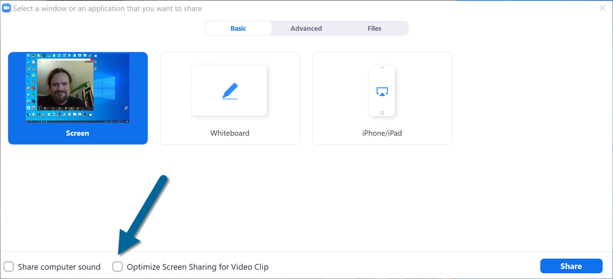
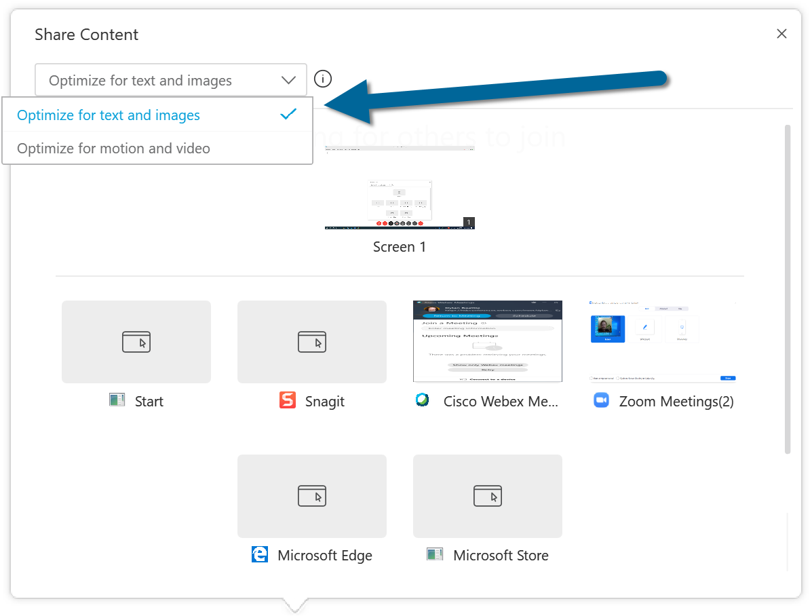

#### A word about codecs

Codec is short for compressor/decompressor – it's how we compress a huge amount of high-definition video information into a digital signal that's small enough to send over the internet in real time, and then decompress it at the other end. Most modern video conferencing systems use two different codecs; one for your camera, and one for sharing your screen – and they are **not the same.** 

The critical difference is about what they'll try to preserve if you have a bad connection or lose signal for a few seconds. The video codec for your camera typically preserves the *frame rate* – blurring is fine, as long as everything keeps moving smoothly. As long as the audience sees your lips moving in sync with your voice, they probably won't notice a bit of blurring around your eyes or your hair. Screen share codecs are designed to preserve *sharpness* – if there's a problem, they'll compensate by dropping frames, which doesn't matter when you're just showing Powerpoint slides and code samples; that stuff doesn't move much anyway.

Most of the time, this doesn't matter – but there are two important exceptions.

First: if your presentation contains lots of embedded video clips or complex animation, or you're going to be playing YouTube videos as part of your demo or something, you'll need to select a special setting when you begin sharing your screen. In Zoom, it's "Optimize Screen Sharing for Video Clip":

In WebEx Meetings, it's a dropdown menu with "Optimize for text and images" or "Optimize for motion and video":

This is an either/or – you can prioritise smooth video or crisp text, but not both. if you're showing HD video clips and then diving straight into some live coding, you may find you need to stop sharing after the video and then start a fresh screen share using the other codec for the live coding part. Depends on your connection, your audience's connections, all kinds of things – but once you know what's going on, you can adapt as required.

The second situation where this matters if you're using something like OBS, ManyCam or Sparkocam to create a "virtual camera". You can do some fantastic stuff with these kinds of tools – if you've got a green screen, you can remove your background and make yourself a talking head in front of your own slides, like a sort of high tech TV weather forecaster. 

The problem is – Zoom, WebEx and most other tools will think that, because the source is a "camera" (albeit a virtual one), they need to optimise for smooth video – and your Powerpoint slides and code samples will look terrible.