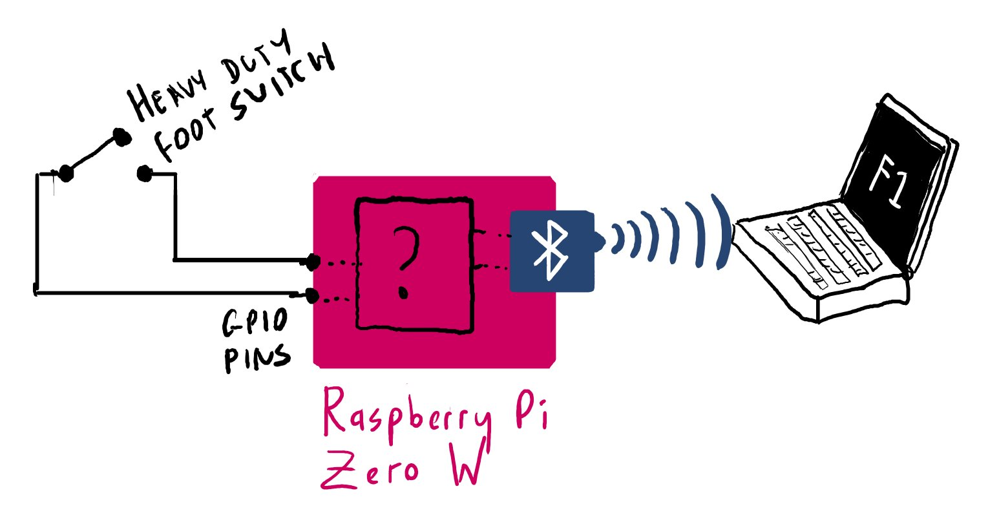
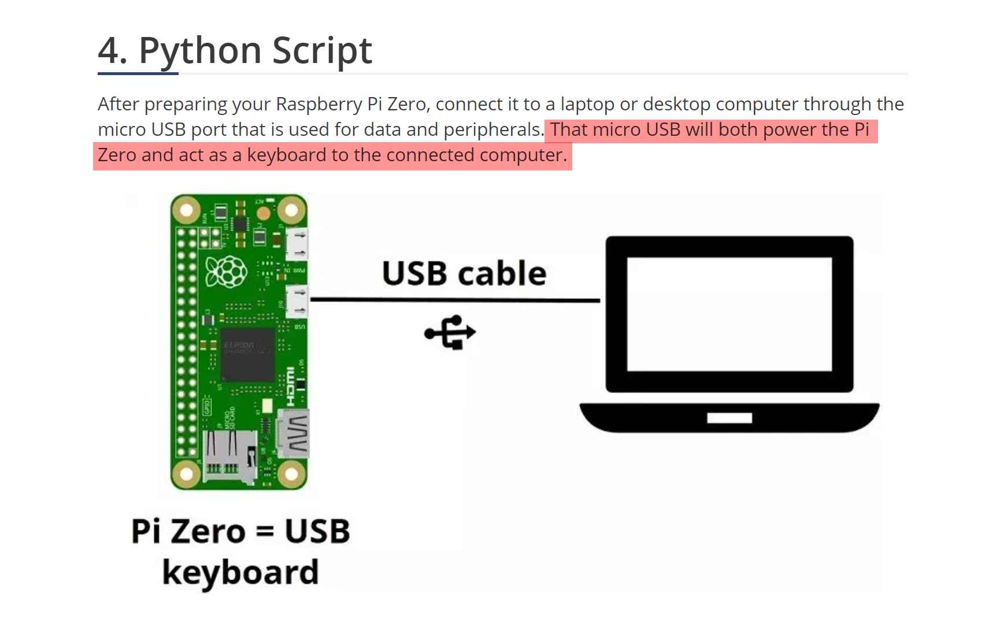
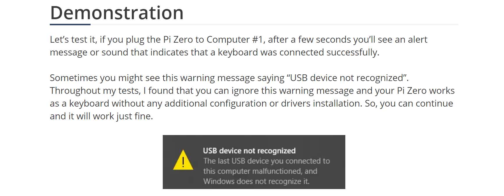

I often find myself doing daft things with computers and playing the guitar at the same time. I use laptops on stage to run videos and backing tracks, I record my own music, and, most recently, I've been doing livestreamed music concerts over YouTube and Twitch for some of the online conferences I've spoken at.

I've used various kinds of foot controllers in the past. The two that have stuck around the longest are the AirTurn PedPro and the iRig Blueboard. The PedPro runs on Bluetooth and works great as a hands-free Powerpoint clicker - it connects to Windows or macOS as a Bluetooth keyboard, but it only has two keys, which are (normally) hardwired to be Left and Right. This works great for controlling Powerpoint, but it's a bit limited. The iRig Blueboard has four footswitches, and works great with iOS and macOS, but it connects to the host system as some kind of proprietary Bluetooth MIDI device, and it doesn't work (at all) on Windows.

So I figured building my own pedalboard might be a fun lockdown project. At a bare minimum, I wanted to be able to switch between scenes in OBS and control some sort of media player at the same time, so I can stop/start videos and backing tracks and switch between different camera angles when doing live streams.

There's two approaches I could have  taken:

* **Network-based:** the footswitch device connects to wifi, sends signals to a host computer over the network, and I build some bespoke software to translate those signals into emulated keystrokes, or controls the target applications directly
* **Device emulation:** the footswitch connects directly to the host PC, via USB or Bluetooth, and shows up as a keyboard, joystick or some other kind of human interface device (HID).

I went for device emulation, mainly because the host PC is already going to be pretty busy handling multiple cameras, OBS, media playback, greenscreen effects, and live network streaming, and having my footswitch just show up as a keyboard seemed a lot more straightforward.

## The Raspberry Pi Zero W

For this version of the project, I used the Raspberry Pi Zero W. Lots of people asked why I didn’t use an Arduino or some other device: truth is, I used a Pi because I like them. They’re really cool devices, they’re lots of fun to work with, and I’ve done some interesting projects with them before so I’m not starting from scratch here. 

One very interesting idea - which I’ll be coming back to in a future project - would be to cannibalise the controller from a Bluetooth keyboard and use that instead of building my own device. More on that in a moment.

The Pi Zero is a tiny Linux computer, not much bigger than a stick of gum. It’s got a 1GHz single-core CPU, 512Mb RAM, a mini HDMI port, two USB ports - one for power, one for peripherals, and - most important of all for this project - a bank of general-purpose input/output (GPIO) pins that you can wire up to external switches, LEDs, sensors, all kinds of things, and then write some pretty simple code to interface with them. Which is brilliant if you want to connect a bunch of mechanical footswitches to a tiny Linux computer and don’t *really* know what your’e doing.

The other nice thing about the Pi Zero W is that it’s got exactly the same hardware and programming interface as its big brother, the Raspberry Pi 4B - so if you get into serious debugging and stuff, you can use the more powerful Pi 4B as your dev platform, get your code working, then pop the MicroSD card out, pop it into the Pi Zero and boot the exact same code on the smaller device.

### Plan A: Bluetooth

My first approach with this project was to get the Pi Zero to connect to the host PC over Bluetooth, and emulate a Bluetooth keyboard. (yay wireless!). I spent a rather fun, if occasionally frustrating, weekend playing around with this. You can read the tweet-by-tweet accounts from [day 1](https://twitter.com/dylanbeattie/status/1256593530279145472) and [day 2](https://twitter.com/dylanbeattie/status/1256899500242804737) -  but to cut a long story short, I couldn’t get it to work well enough for what I wanted. 

I got to the point where I could boot the Pi, start the various Python scripts, then go onto my Windows machine and add a new Bluetooth device - and it worked. The device would show up as **paired**, then **connected**, and it would actually send keystrokes to the host PC:

<blockquote class="twitter-tweet">
I have hardware switches connected to the Pi Zero GPIO pins. Pressing a switch sends a a keystroke to the Windows PC. The PC thinks it’s talking to a Bluetooth keyboard. The whole thing is as hacky as all hell - but it works. :) <a href="https://t.co/VQp5jHjG8a">pic.twitter.com/VQp5jHjG8a</a>
&mdash; Dylan Beattie 🇪🇺 @ 🏡🔑🔽 (@dylanbeattie) <a href="https://twitter.com/dylanbeattie/status/1257017418351812608?ref_src=twsrc%5Etfw">May 3, 2020</a></blockquote> 

There was a problem, though. When I stopped the Python script that was running the Bluetooth service on the Pi, the device would go from **connected** to **paired** - and I could not find any way to get it to reconnect without removing and re-adding it. Which made the whole thing a bit impractical, particularly if I was going to try using it in any kind of live performance situation.

<blockquote class="twitter-tweet">
Any folks out there who know the intimate details of the bluez Bluetooth stack? I need to force a Linux device to connect to a host that’s already paired... you can see exactly what I mean in the video here. Any help much, much appreciated. <a href="https://t.co/7YOYV59NfE">pic.twitter.com/7YOYV59NfE</a>
&mdash; Dylan Beattie 🇪🇺 @ 🏡🔑🔽 (@dylanbeattie) <a href="https://twitter.com/dylanbeattie/status/1259265653296463882?ref_src=twsrc%5Etfw">May 9, 2020</a></blockquote>   

In this video, you can see that with my Logitech K380 Bluetooth keyboard, this works perfectly - and part of me wishes I’d just cannibalised a K380, taken out the controller chips and switches, and wired my own footswitches into it. That would have made the hardware side of this a lot more straightforward… but hey, we live and learn, right?

## Plan B: Wired USB

Bluetooth isn’t actually a requirement here. Wires are OK - this is to control a stationary computer from a stationary footswitch, and it turns out the Pi Zero will also quite happily emulate any number of USB gadgets, from virtual keyboards to joysticks and network interfaces.

The milestone here was to get to a point where:

* The Pi Zero is connected to a Windows 10 PC via USB
* The Windows PC thinks the Pi Zero is a keyboard
* I can run some Python code on the Pi Zero to send arbitrary keystrokes (including modifier keys) to the PC

This was actually pretty straightforward, thanks to a really great article “[Composite USB Gadgets on the Raspberry Pi Zero]()” over over at iSticktoit.net. I did have one slight stumbling block… when I first started working on this, I originally found [this tutorial](https://randomnerdtutorials.com/raspberry-pi-zero-usb-keyboard-hid/) instead.  That’s almost exactly the same - I don’t know whether the content is syndicated or plagiarised, but the code samples are *identical* - except the Random Nerd Tutorials article says quite clearly that you can run the whole thing off a single micro USB port:

Now, a little later in the article, our Random Nerd author does actually say:

To say this does not match my own experience would be putting it mildly… the first few times I tried booting the Pi drawing power through this USB port, it caused all sorts of chaos, including completely shutting down the entire USB bus on my Windows PC more than once, leaving me with no mouse and no keyboard. That was fun.

After a few rounds of this, I tried booting the Pi using standalone USB power, waiting until it was up and running, and then connecting the second USB port to the host PC - and it worked flawlessly.

**Boot the Pi using dedicated USB power. Once it is up and running, connect the peripheral USB port to the host PC, and everything works fine.**

## The Code

First, go through the entire iSticktoit tutorial above - this will create your USB device, initialise it at boot time, and allow you to send keystrokes to it by writing data to `/dev/hidg0`

Next up, we need a bit of Python code that will detect when a circuit is closed across a pair of GPIO pins, and send a particular keystroke over the USB interface when this happens. This is wonderfully, beautifully simple on the Pi Zero, thanks to the RPi.GPIO library that makes it really easy to write Python code that talks to the GPIO pins.

