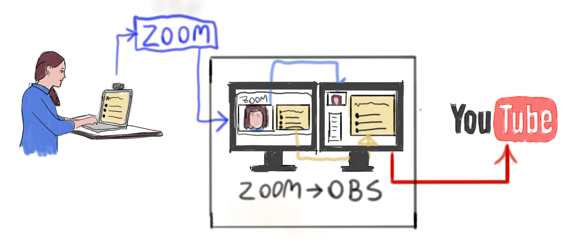
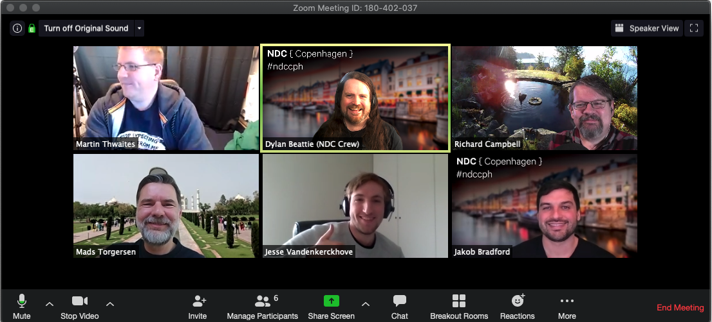

A month ago, I was in Denmark doing a [promotional event for NDC Copenhagen](https://www.meetup.com/Copenhagen-Net-User-Group/events/268797049/) - and nobody was even considering the possibility that we might have to turn it into an online-only event – but as the [agile manifesto](https://agilemanifesto.org/) says, developers should be prepared to respond to change instead of following a plan. And, wow, the last four weeks have been intense. We've had less than a month to turn a physical conference into fully virtual online event - two days of workshops, one day of talks across three tracks,  nearly 250 attendees and speakers...

We did it. Right now there's three talks streaming live, there's 247 people online on Slack, there's Q&A happening in the Slack channels, I'm watching Scott Helme stream his "Stories from the Trenches" infosec talk live on YouTube, and it's all working remarkably well. Here's how we did it.

<iframe width="560" height="315" src="https://www.youtube.com/embed/Ecfs130BDws" frameborder="0" allow="accelerometer; autoplay; encrypted-media; gyroscope; picture-in-picture" allowfullscreen></iframe>

## Transparency and Trust > Technology and Tools 

We worked hard to keep speakers and attendees in the loop about what was going on. I ran webinars and Q&A sessions last week for all of our workshop trainers and presenters, we ran another online session on Monday for attendees, and I've been running ad-hoc equipment checks and Zoom sessions with speakers to help them make sure everything's set up and good to go. It's been a very steep learning curve for all of us, but it's worked.

We also solved a lot of potentially complex problem by deciding, early on, that were going to trust people. Attendees would get invited to a Slack workspace but we weren't going to require authentication; we'd run live streams as unlisted YouTube streams and trust our attendees not to share the links. This meant we didn't have to worry about passwords and security and managing access, and could just focus on the attendee experience, the speakers and the content.

## Familiar Tools

Over the last few weeks, I've tested every single video conferencing and online chat platform I'd ever heard of, and a few that I hadn't. WebEx, Whereby, GoToMeeting, Zoom, Hangouts, Skype, Slack, Discord, Jitsi - and I'm sure there's a few that I missed. 

Let's put it this way. None of them is remotely close to meeting together in real life, but all of them are vastly better than getting sick with coronavirus - so it comes down to what constraints and capabilities we're optimising for, and what we're prepared to compromise on.

There are virtual conference platforms out there - but there's no way we were going to have enough time to evaluate the options, choose a platform, get the crew and volunteers up to speed, set up accounts for the speakers and partners, and have it all ready to go by April 1st. So we decided to go with familiar tools.

We set up a dedicated Slack workspace for NDC Copenhagen 2020, and decided that would be the backbone of the virtual conference. Folks who bought tickets got invited to join the Slack workspace, we use Slack for discussion, announcements, Q&A, chat, and - here's the key part - at the end of the conference, we're going to delete the workspace. That's it: conference is over, see you at the next one.

### How We Set Up Slack

* Every Slack workspace has a `#general` channel. We renamed `#general` to `#announcements`, and locked it down so that only administrators could post to it and nobody could start threads.
* We created dedicated channels for each conference track, which we used for speaker Q&A and audience feedback.
* We set up a `#hallway-track` for attendees, a `#speaker-lounge` private channel for speakers, and a dedicated `#organisers` channel for the NDC crew and volunteers.
* We locked down most options, so that attendees couldn't invite other people, couldn't create custom emoji, that kind of thing.

### How We Streamed Talks

We went with a hybrid approach here. My initial idea was to use Zoom for all the sessions - to start a Zoom meeting for each track, and have speakers and attendees join and leave those meetings over the course of the day, just like folks wandering in and out of session rooms at a physical conference. I'd run a bunch of meetups and social events on Zoom, with 50+ people in the same meeting, and it worked pretty well.

We had several requests from attendees to be able to watch the live streams without actually joining a room. That might sound a bit weird, but NDC Oslo has always had an overflow room; all nine tracks are projected on big-screen TVs, you can sit with a pair of headphones and jump between talks without disturbing anybody, and we wanted to try to replicate that for the virtual event. 

So, with some help from the crew from [Video for Web](https://videoforweb.no/) in Norway, here's the setup we ended up running.

1. Each conference track is a Zoom meeting, that starts around 8am and runs right through the day. One of the NDC crew stays in that meeting all day - they're the track host; they'll help speakers get set up and connected. 
2. The Video for Web crew have three separate PCs, each one connected to a different Zoom track. These are running Open Broadcast System (OBS) - they'll do a live capture of the speaker video and screen share from the Zoom call, combine this with the Slido feed and some NDC branding, and stream the result to YouTube.
3. We email every speaker an invitation in advance, including the Zoom link and password to join the appropriate track, and the time of their meeting, including the timezone - more about that in a moment
4. The speaker joins the Zoom track 10-15 minutes before their talk session, checks their camera and audio are working, and begins sharing their screen.
5. When the talk starts, the Video for Web team switch over each stream to the live feed coming from Zoom via OBS.
6. We embed the YouTube stream link in each of the Slack channels for tracks 1-3.

For a couple of my talks, I also shared the direct Zoom link in the Slack channel in case folks wanted to join directly, which actually worked really well - more on this later. We also ran Slido alongside every session, giving the audience the chance to ask questions during the talks.

## What We Learned

### Some Folks Like Zoom, Some Folks Like YouTube

For the talks where I shared the Zoom link, I got 5-10 attendees joining the Zoom call directly, with the rest watching over YouTube.

As a speaker, it's amazing how much difference it makes even just having a few people "in the room" - we kept the audiences muted, but being able to see people smiling and raising hands makes the whole thing feel so much more like a live presentation. The YouTube stream has about 30 seconds of latency - so the quality's great, but if you tell a joke, people on YouTube laugh 30 seconds later, so there's really no way to use the YouTube stream as part of any realtime audience interaction.

So for future events, I'm going to try to run a hybrid format where there's a real-time option like Zoom or Hangouts for people who want to be part of the "live" audience, and a close-to-real-time YouTube stream for folks who want to dip in and out or have it on in the background.

### Zoom socialising? Nice idea... but doesn't really happen

One of my favourite things about conferences is the ad-hoc conversations that happen - in the coffee queue, over lunch, over drinks at the end of the day. We tried to replicate that using Zoom by spinning up chatrooms between sessions, but for some reason it just doesn't work - nobody joins the rooms and it never really catches on. We did run an online quiz event last night, which got about 20 people online at one point - but most of them stayed muted with their webcams switched off; I could see them playing along and answering questions on Slido but I wouldn't say we had much in the way of conversation.

That said, there's been some great conversation happening in the workshop groups over the past two days, so it's not the tool or the format that's the problem...  I've already written several posts about the weirdness of trying to socialise online; I suspect this is just one more thing that people haven't figured out yet. We'll get there.

### Slido needs a nudge to get people using it

We ran Slido live Q&A sessions for all the conference talks. Some talks, it didn't get used at all; but those talks where it *did* get used, it was completely silent until somebody asked the first question - and then it got very lively.

I think there's two reasons for this... first, until somebody asks a question, it's just a static panel in the corner of the live stream. Once the first question appears, there's some movement and some action and people go "ooh, I want to use that!" I also know there's some weird cultural things about certain audiences where folks are more than happy to interact but nobody wants to go first, and I haven't worked out yet whether that's more or less pronounced when the events are running online.

So - if we're going to use Slido in future, we'll have a couple of prepared questions standing by to start things off; once folks see it being used, they'll probably dive in and get the conversation going.

### USB-powered lights are literally the devil... 😈

One of the speakers was having huge problems with audio - pops, crackles, weird electrical interference. We spent literally hours trying to track down the problem - reinstalling drivers, checking different mics on different platforms... and eventually worked out that they were running a USB-powered light off one of the computer's USB sockets, which was generating some really, really weird interference.

There's a separate post coming up about how to set up and test equipment for doing live remote presentations, but it looks like one of the golden rules is: don't have **anything** plugged in to your USB ports that isn't required to do your talk. Webcam, microphone, whatever you need to do your presentation or live demos - but if you're using USB ports to power lights or charge your phone or anything, unplug it until you're done.

### So... What's Next?

In another life, I was getting on a plane tomorrow, flying from Copenhagen to Saint-Petersburg via Helsinki, presenting The Art of Code at DotNext, travelling from there to Riga and then on to Kyiv for .NET fwdays - and then back on the NDC bandwagon at the end of April for NDC Porto.

But here in the upside-down, that's all postponed, cancelled or gone virtual, so the next big thing on the schedule is NDC Porto, which we're now running as another online event. Copenhagen's gone great, we've learned a *lot* about what works, what doesn't work; we've got lots of interesting new ideas to try and lots of valuable feedback and information to share with all our speakers...

For now, though, I'm gonna open a beer, fire up a Zoom call and enjoy a bit of post-conference relaxation. See y'all for the next one!

